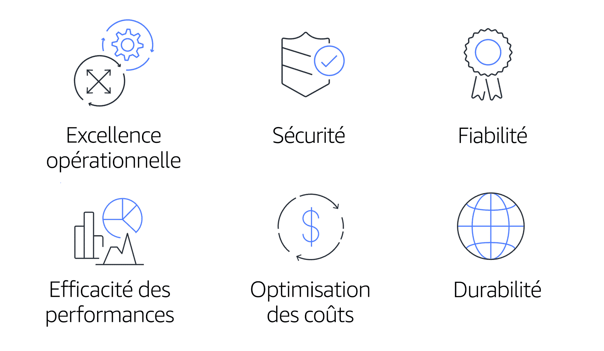

## Introduction du module 10 et objectifs

- Résumer les six piliers du cadre Well-Architected Framework.  
- Expliquer les six avantages du cloud computing.

---

## Le cadre AWS Well-Architected Framework

Six pilliers

<!-- .element height="55%" width="55%" --> 

---

## Excellence opérationnelle

- L'Excellence opérationnelle est la capacité d'exécuter et de surveiller les systèmes pour assurer une valeur métier et pour améliorer en continu les processus et procédures de prise en charge.  
- Les principes de conception de l'excellence opérationnelle dans le cloud incluent l'exécution d'opérations sous forme de code, l'annotation de documentation, l'anticipation des échecs et l'application fréquente de petites modifications réversibles.

---

## Sécurité

- Le pilier Sécurité représente la capacité à protéger les informations, les systèmes et les ressources tout en fournissant une valeur métier par le biais de stratégies d'évaluation et de limitation des risques. 
- bonnes pratiques:
   - Automatisez les bonnes pratiques de sécurité lorsque cela est possible.
   - Appliquez la sécurité à toutes les couches.
   - Protégez les données en transit et au repos.

---

## Fiabilité

- Récupérer après les interruptions de service ou d'infrastructure
- Acquérir dynamiquement des ressources de calcul pour répondre à la demande
- Atténuer les perturbations telles que les erreurs de configuration ou les problèmes de réseau temporaires
- La fiabilité comprend le test des procédures de reprise, la mise à l'échelle horizontale pour renforcer la disponibilité globale du système, ainsi que la reprise automatique après une défaillance.

---

## Efficacité des performances

- L'efficacité des performances est la capacité d'utiliser efficacement les ressources de calcul pour répondre aux exigences du système et maintenir l'efficacité au fur et à mesure que la demande change et que les technologies évoluent. 
- Pour évaluer l'efficacité des performances de votre architecture, il faut expérimenter plus souvent, utiliser des architectures serverless et concevoir des systèmes pouvant toucher le monde entier en quelques minutes.

---

## Optimisation des coûts

- L'optimisation des coûts est la capacité à exécuter des systèmes de façon à assurer une valeur métier au niveau de prix le plus bas.
- L'optimisation des coûts inclut l'adoption d'un modèle de consommation, l'analyse et l'attribution des dépenses et l'utilisation de services gérés pour réduire le coût de possession.

---

## La durabilité 

- Capacité à continuellement améliorer les impacts sur la durabilité en réduisant la consommation d'énergie et en augmentant l'efficacité pour tous les composants d'une charge de travail en optimisant les avantages des ressources mises en service et en minimisant le nombre total de ressources requises.

  - Comprenez votre impact
  - Définissez des objectifs de durabilité
  - Optimisez l'utilisation
  - Anticipez et adoptez de nouvelles offres de matériels et de logiciels plus efficaces
  - Utilisez des services gérés
  - Réduisez l'impact en aval de vos charges de travail dans le cloud

---

<!-- .slide: data-auto-animate -->
<!-- .slide: data-auto-animate -->
#### Quiz: Quel pilier du cadre AWS Well-Architected Framework met l'accent sur la capacité d'une charge de travail à exécuter de manière cohérente et appropriée les fonctions prévues ? <!-- .element: style="color:#fd9731;" -->

- Excellence opérationnelle
- Efficacité des performances
- Sécurité
- Fiabilité

---

<!-- .slide: data-auto-animate -->
#### Quiz: Quel pilier du cadre AWS Well-Architected Framework met l'accent sur la capacité d'une charge de travail à exécuter de manière cohérente et appropriée les fonctions prévues ? <!-- .element: style="color:#fd9731;" -->

- Excellence opérationnelle
- Efficacité des performances
- Sécurité
- Fiabilité <!-- .element: style="color:#0de07d;" -->

---

## Avantages du cloud computing

- Remplacer les dépenses initiales par les dépenses variables.
- Bénéficier d'importantes économies d'échelle.
- Cesser de deviner la capacité nécessaire.
- Gagner en vitesse et en agilité.
- Ne plus dépenser d'argent pour l'exécution et la maintenance des centres de données.
- Passer à l'international en quelques minutes

---

<!-- .slide: data-auto-animate -->
#### Quiz: Quel processus confère d'importantes économies d'échelle ? <!-- .element: style="color:#fd9731;" -->

- Déploiement d'une application dans plusieurs régions du monde
- Tarification à l'utilisation moindre en raison de l'utilisation groupée des services par les clients AWS
- Paiement du temps de calcul au fur et à mesure de votre utilisation, plutôt que d'investir des frais initiaux dans des centres de données
- Mise à l'échelle de la capacité de vos infrastructures pour répondre à la demande

---

<!-- .slide: data-auto-animate -->
#### Quiz: Quel processus confère d'importantes économies d'échelle ? <!-- .element: style="color:#fd9731;" -->

- Déploiement d'une application dans plusieurs régions du monde
- Tarification à l'utilisation moindre en raison de l'utilisation groupée des services par les clients AWS <!-- .element: style="color:#0de07d;" -->
- Paiement du temps de calcul au fur et à mesure de votre utilisation, plutôt que d'investir des frais initiaux dans des centres de données
- Mise à l'échelle de la capacité de vos infrastructures pour répondre à la demande

---

<!-- .slide: data-auto-animate -->
#### Quiz: Quel pilier du cadre AWS Well-Architected Framework inclut la capacité à efficacement exécuter des charges de travail et à obtenir des informations sur leurs opérations ? <!-- .element: style="color:#fd9731;" -->

- Optimisation des coûts
- Excellence opérationnelle
- Efficacité des performances
- Fiabilité

---

<!-- .slide: data-auto-animate -->
#### Quiz: Quel pilier du cadre AWS Well-Architected Framework inclut la capacité à efficacement exécuter des charges de travail et à obtenir des informations sur leurs opérations ? <!-- .element: style="color:#fd9731;" -->

- Optimisation des coûts
- Excellence opérationnelle <!-- .element: style="color:#0de07d;" -->
- Efficacité des performances
- Fiabilité

---

<!-- .slide: data-auto-animate -->
#### Quiz: Quels sont les avantages du cloud computing ? (Sélectionnez DEUX propositions.) <!-- .element: style="color:#fd9731;" -->

- Gagner en vitesse et en agilité
- Bénéficier d'économies d'échelle moindres.
- Négocier les dépenses variables pour les dépenses initiales.
- Maintenir la capacité des infrastructures.
- Ne dépensez plus d'argent pour l'exécution et la maintenance des centres de données.

---

<!-- .slide: data-auto-animate -->
#### Quiz: Quels sont les avantages du cloud computing ? (Sélectionnez DEUX propositions.) <!-- .element: style="color:#fd9731;" -->

- Gagner en vitesse et en agilité <!-- .element: style="color:#0de07d;" -->
- Bénéficier d'économies d'échelle moindres.
- Négocier les dépenses variables pour les dépenses initiales.
- Maintenir la capacité des infrastructures.
- Ne dépensez plus d'argent pour l'exécution et la maintenance des centres de données. <!-- .element: style="color:#0de07d;" -->