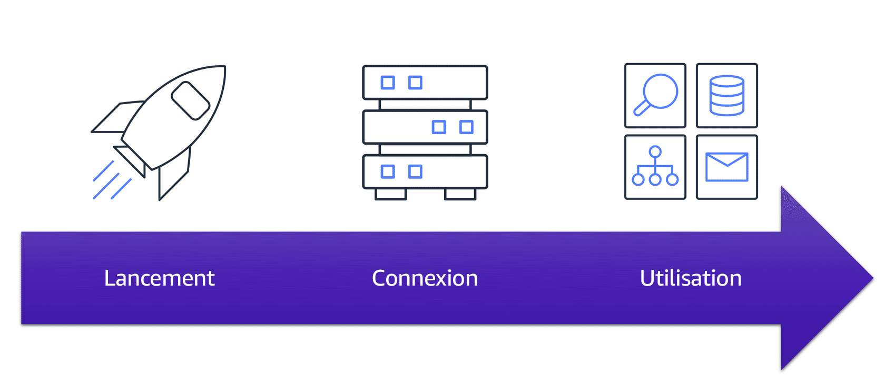
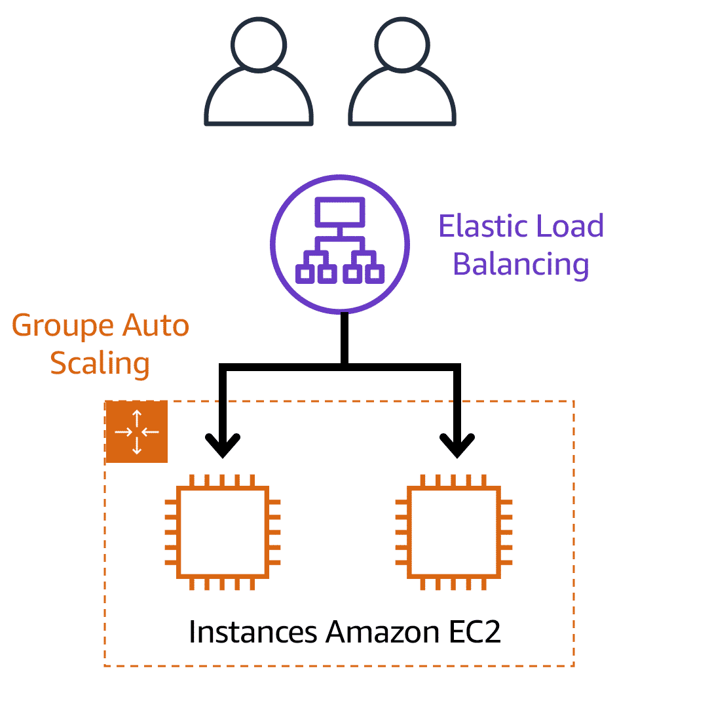
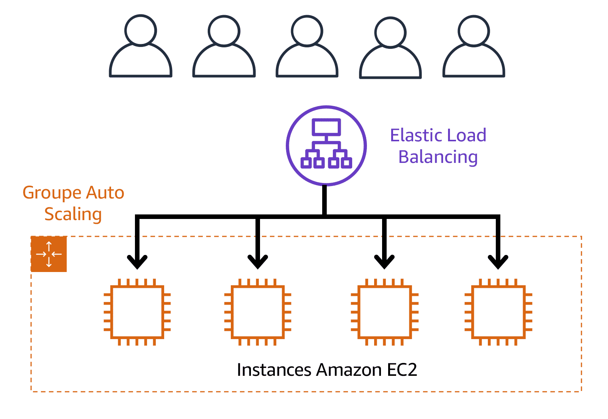
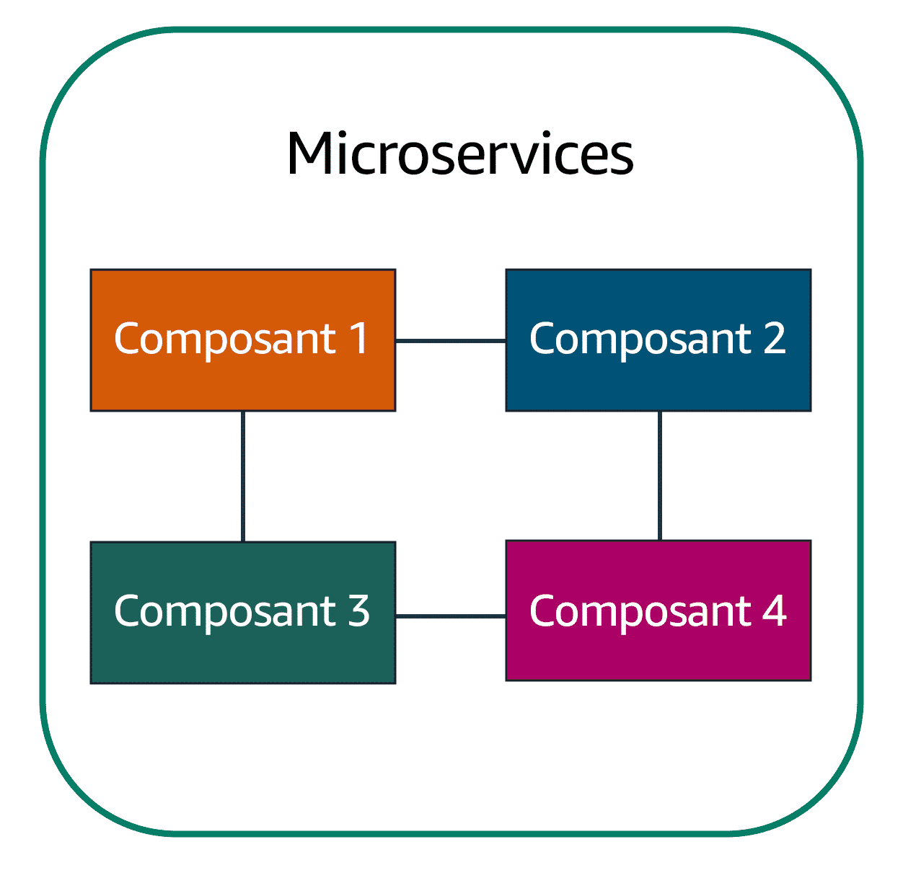

## Introduction du module 2 et objectifs

- décrire les avantages d'Amazon EC2 à un niveau de base ;
- identifier les différents types d'instances Amazon EC2 ;
- faire la distinction entre les diverses options de facturation pour Amazon EC2 ;
- résumer les avantages d'Amazon EC2 Auto Scaling ;
- résumer les avantages d'Elastic Load Balancing ;
- donner un exemple d'utilisation d'Elastic Load Balancing ;
- résumer les différences entre Amazon Simple Notification Service (Amazon SNS) et Amazon Simple Queue Service (Amazon SQS)
- résumer les options de calcul AWS supplémentaires
---

## Amazon Elastic Compute Cloud (Amazon EC2)

Amazon Elastic Compute Cloud (Amazon EC2) fournit une capacité de calcul sécurisée et redimensionnable dans le cloud en tant qu'instances Amazon EC2. 

Imaginez que vous êtes responsable de l'architecture des ressources de votre entreprise et que vous avez besoin de prendre en charge de nouveaux sites web. Avec les ressources sur site traditionnelles, vous devez effectuer les opérations suivantes :

- Faire des dépenses initiales pour acheter du matériel
- Attendre que les serveurs vous soient livrés
- Installer les serveurs dans votre centre de données physique
- Faire toutes les configurations nécessaires

---

## Amazon Elastic Compute Cloud (Amazon EC2)

En comparaison, avec une instance Amazon EC2, vous pouvez utiliser un serveur virtuel pour exécuter des applications dans le Cloud AWS.

- Vous pouvez mettre en service et lancer une instance Amazon EC2 en quelques minutes.
- Vous pouvez cesser de l'utiliser lorsque vous avez terminé d'exécuter une charge de travail.
- Vous payez uniquement le temps de calcul que vous utilisez lorsqu'une instance est en cours d'exécution, et non lorsqu'elle est arrêtée ou résiliée.
- Vous pouvez économiser sur ces coûts en payant uniquement la capacité de serveur dont vous avez besoin ou que vous souhaitez.

---

## Fonctionnement d'Amazon EC2

---

## Types d'instances Amazon EC2

- Instances à usage général ;
- Instances de calcul optimisées ;
- Instances optimisées en mémoire ;
- Instances de calcul accéléré
- Instances avec stockage optimisé

---

## Instances à usage général

Les instances à usage général fournissent un équilibre entre les ressources de calcul, de mémoire et de mise en réseau. Vous pouvez les utiliser pour une variété de charges de travail, telles que :

- les serveurs d'applications ;
- les serveurs de jeux ;
- les serveurs backend pour les applications d'entreprise ;
- les bases de données petites et moyennes.

Supposons que vous ayez une application dans laquelle les besoins en ressources pour le calcul, la mémoire et la mise en réseau sont à peu près équivalents. Vous pouvez envisager de l'exécuter sur une instance à usage général, car l'application ne nécessite aucune optimisation dans une seule zone de ressources.

---

## Instances de calcul optimisées

Les instances de calcul optimisées sont idéales pour les applications liées aux calculs qui bénéficient des processeurs hautes performances. Comme les instances à usage général, vous pouvez utiliser des instances de calcul optimisées pour des charges de travail telles que des serveurs web, d'applications et de jeux.

Cependant, la différence est que les applications de calcul optimisées sont idéales pour les serveurs web hautes performances, les serveurs d'applications exigeantes en calcul et les serveurs de jeux dédiés. Vous pouvez également utiliser des instances de calcul optimisées pour les charges de travail de traitement par lots qui nécessitent le traitement de nombreuses transactions dans un seul groupe.

---

## Instances optimisées en mémoire

Les instances optimisées en mémoire sont conçues pour fournir des performances rapides pour les charges de travail qui traitent de grands jeux de données en mémoire. Avant qu'un programme ou une application ne puisse s'exécuter, il est chargé depuis le stockage dans la mémoire. Ce processus de préchargement donne au CPU un accès direct au programme informatique.

Les instances optimisées pour la mémoire vous permettent d'exécuter des charges de travail avec des besoins de mémoire élevés et de bénéficier de performances exceptionnelles. Exemples scénario : une base de données hautes performances ou une charge de travail impliquant le traitement en temps réel d'une grande quantité de données non structurées

---

## Instances de calcul accéléré

Les instances de calcul accéléré utilisent des accélérateurs matériels, ou coprocesseurs, pour exécuter certaines fonctions plus efficacement que ce qui est possible dans les logiciels s'exécutant sur des processeurs. Les exemples de ces fonctions incluent les calculs de nombres à virgule flottante, le traitement de graphiques et l'appariement des schémas de données.

En informatique, un accélérateur matériel est un composant qui peut accélérer le traitement des données. Les instances de calcul accéléré sont idéales pour les charges de travail telles que les applications graphiques, le streaming de jeux et le streaming d'applications.

---

## Instances de stockage optimisé

- Elles sont conçues pour les charges de travail qui nécessitent un accès élevé en lecture et en écriture séquentielle à de grands jeux de données sur le stockage local. 
- Les systèmes de fichiers distribués
- les applications d'entreposage de données et les systèmes de traitement transactionnel en ligne à haute fréquence

En calcul, les opérations d'entrée/sortie par seconde (IOPS) sont une métrique qui indique les performances d'un périphérique de stockage. Elle indique le nombre d'opérations d'entrée ou de sortie différentes qu'un périphérique peut effectuer en une seconde.

---

<!-- .slide: data-auto-animate -->
#### Quiz: Quel type d'instance Amazon EC2 convient aux applications d'entreposage de données ? <!-- .element: style="color:#fd9731;" -->

- Optimisée en mémoire
- Avec stockage optimisé
- À usage général
- De calcul optimisée

---

<!-- .slide: data-auto-animate -->
#### Quiz: Quel type d'instance Amazon EC2 convient aux applications d'entreposage de données ? <!-- .element: style="color:#fd9731;" -->

- Optimisée en mémoire
- Avec stockage optimisé <!-- .element: style="color:#0de07d;" -->
- À usage général
- De calcul optimisée

---

<!-- .slide: data-auto-animate -->
#### Quiz: Quel type d'instance Amazon EC2 équilibre les ressources de calcul, de mémoire et de mise en réseau ? <!-- .element: style="color:#fd9731;" -->

- Optimisée en mémoire
- Avec stockage optimisé
- À usage général
- De calcul optimisée

---

<!-- .slide: data-auto-animate -->
#### Quiz: Quel type d'instance Amazon EC2 équilibre les ressources de calcul, de mémoire et de mise en réseau ? <!-- .element: style="color:#fd9731;" -->

- Optimisée en mémoire
- Avec stockage optimisé
- À usage général <!-- .element: style="color:#0de07d;" -->
- De calcul optimisée

---

<!-- .slide: data-auto-animate -->
#### Quiz: Quel type d'instance Amazon EC2 est idéal pour les bases de données hautes performances ? <!-- .element: style="color:#fd9731;" -->

- Optimisée en mémoire
- Avec stockage optimisé
- À usage général
- De calcul optimisée

---

<!-- .slide: data-auto-animate -->
#### Quiz: Quel type d'instance Amazon EC2 est idéal pour les bases de données hautes performances ? <!-- .element: style="color:#fd9731;" -->

- Optimisée en mémoire <!-- .element: style="color:#0de07d;" -->
- Avec stockage optimisé
- À usage général
- De calcul optimisée

---

<!-- .slide: data-auto-animate -->
#### Quiz: Quel type d'instance Amazon EC2 propose des processeurs hautes performances ? <!-- .element: style="color:#fd9731;" -->

- Optimisée en mémoire
- Avec stockage optimisé
- À usage général
- De calcul optimisée

---

<!-- .slide: data-auto-animate -->
#### Quiz: Quel type d'instance Amazon EC2 propose des processeurs hautes performances ? <!-- .element: style="color:#fd9731;" -->

- Optimisée en mémoire
- Avec stockage optimisé
- À usage général
- De calcul optimisée <!-- .element: style="color:#0de07d;" -->

---

## Tarification Amazon EC2

- À la demande
- Instances réservées
- EC2 Instance Savings Plans
- Instances Spot
- Hôtes dédiés

---

## À la demande

Les instances à la demande sont idéales pour les charges de travail irrégulières à court terme qui ne peuvent être interrompues. Aucun coût initial ou contrat minimum ne s'applique. Les instances s'exécutent en continu jusqu'à ce que vous les arrêtiez, et vous payez uniquement le temps de calcul que vous utilisez.

Le développement et le test d'applications dont les modèles d'utilisation sont imprévisibles ont des exemples de cas d'utilisation des instances à la demande. Les instances à la demande ne sont pas recommandées pour les charges de travail qui durent un an ou plus, car ces charges de travail peuvent bénéficier d'économies plus importantes grâce aux instances réservées.

---

## Instances réservées

offrent une réduction sur votre facture appliquée à l'utilisation des instances à la demande dans votre compte. Vous pouvez acheter des Standard Reserved Instances et des instances réservées convertibles pour une période d'un an ou de 3 ans. Vous réalisez des économies plus importantes avec l'option 3 ans. 

- Standard Reserved Instance (Instances réservées standard) : Le Type et taille de l'instance (ex: m5.xlarge) et la localisation (région aws) sont connus
  
- Instance réservée convertible : executer les instances dans différentes zones de disponibilité ou différentes types d'instance. Une remise plus importante

À la fin d'une période d'instance réservée, vous pouvez continuer à utiliser l'instance EC2 sans interruption. Toutefois, des tarifs à la demande vous sont facturés jusqu'à ce que vous effectuiez l'une des opérations suivantes :
- Résilier l'instance
- Acheter une nouvelle instance réservée qui correspond aux attributs de l'instance (famille et type d'instance, région, plateforme et location)

---

## EC2 Instance Savings Plans

AWS propose des Savings Plans pour certains services de calcul, notamment Amazon EC2. Les EC2 Instance Savings Plans offrent des réductions de coûts pour les instances EC2 en échange d'un engagement de dépense horaire sur 1 ou 3 ans, avec des économies pouvant atteindre 72 % par rapport aux tarifs à la demande.

Les Savings Plans facturent l'utilisation incluse à un tarif réduit, tandis que l'utilisation supplémentaire est facturée au tarif standard. Ces plans offrent une flexibilité accrue par rapport aux instances réservées, car il n'est pas nécessaire de spécifier à l'avance le type, la taille de l'instance, le système d'exploitation ou la location, et il n'y a pas d'engagement sur un nombre d'instances EC2.

AWS Cost Explorer peut être utilisé pour visualiser et gérer les coûts et l'utilisation AWS, et fournit des recommandations personnalisées pour les Savings Plans basées sur l'utilisation passée d'Amazon EC2.

---

## Instances Spot

Les instances Spot sont parfaites pour les charges de travail aux horaires flexibles ou tolérantes aux interruptions. Elles utilisent les capacités inutilisées d'Amazon EC2, permettant des économies allant jusqu'à 90 % par rapport aux prix à la demande.

Par exemple, pour une tâche de traitement en arrière-plan pouvant démarrer et s'arrêter sans impact sur l'ensemble des opérations (comme le traitement de données pour une enquête client), les instances Spot sont idéales. Si la capacité EC2 est disponible, votre instance Spot démarre. Sinon, la demande est en attente jusqu'à ce que la capacité soit disponible, ce qui peut retarder le lancement de votre tâche.

Une instance Spot peut être interrompue si la capacité devient indisponible ou si la demande d'instances Spot augmente. Cela convient aux tâches en arrière-plan tolérantes aux interruptions, mais pour des tâches comme le développement et le test d'applications, il est préférable de choisir un autre type d'instance EC2 pour éviter les interruptions inattendues.

---

## Hôtes dédiés

Les hôtes dédiés sont des serveurs physiques avec des capacités d'instance Amazon EC2 intégralement dédiées à votre utilisation. 

Vous pouvez utiliser vos licences logicielles par socket, par cœur ou par machine virtuelle existantes pour vous aider à maintenir la conformité des licences. Vous pouvez acheter des réservations d'hôtes dédiés à la demande et d'hôtes dédiés. De toutes les options Amazon EC2 couvertes, les hôtes dédiés sont les plus chers.

---

<!-- .slide: data-auto-animate -->
#### Quiz: Quelle option de tarification Amazon EC2 offre une remise lorsque vous indiquez un nombre d'instances EC2 pour exécuter un système d'exploitation, une famille et taille d'instance ainsi qu'une location spécifiques dans une seule région ? <!-- .element: style="color:#fd9731;" -->

- Instances réservées convertibles
- EC2 Instance Savings Plans
- Instances Spot
- Standard Reserved Instance

---

<!-- .slide: data-auto-animate -->
#### Quiz: Quelle option de tarification Amazon EC2 offre une remise lorsque vous indiquez un nombre d'instances EC2 pour exécuter un système d'exploitation, une famille et taille d'instance ainsi qu'une location spécifiques dans une seule région ? <!-- .element: style="color:#fd9731;" -->

- Instances réservées convertibles
- EC2 Instance Savings Plans
- Instances Spot
- Standard Reserved Instance <!-- .element: style="color:#0de07d;" -->

---

<!-- .slide: data-auto-animate -->
#### Quiz: Quelle option de tarification Amazon EC2 offre une remise lorsque vous avez un engagement de dépense horaire envers une famille d'instance et une région sur 1 ou 3 ans ? <!-- .element: style="color:#fd9731;" -->

- À la demande
- EC2 Instance Savings Plans
- Instances Spot
- Instances réservées

---

<!-- .slide: data-auto-animate -->
#### Quiz: Quelle option de tarification Amazon EC2 offre une remise lorsque vous avez un engagement de dépense horaire envers une famille d'instance et une région sur 1 ou 3 ans ? <!-- .element: style="color:#fd9731;" -->

- À la demande
- EC2 Instance Savings Plans <!-- .element: style="color:#0de07d;" -->
- Instances Spot
- Instances réservées

---

## Mise à l'échelle Amazon EC2

- La capacité de mise à l'échelle implique de commencer uniquement avec les ressources dont vous avez besoin et de concevoir votre architecture pour répondre automatiquement à l'évolution de la demande en mettant à l'échelle. 
- Par conséquent, vous ne payez que les ressources que vous utilisez. 
- Vous n'avez pas à vous soucier d'un manque de capacité de calcul pour répondre aux besoins de vos clients.

Service AWS :  **Amazon EC2 Auto Scaling**

---

## Amazon EC2 Auto Scaling

- Permet d'ajouter ou de supprimer automatiquement des instances Amazon EC2 en réponse à l'évolution de la demande des applications. 
- En mettant automatiquement à l'échelle vos instances en fonction des besoins, vous pouvez conserver une meilleure disponibilité des applications.

- Deux approches : 
    * La mise à l'échelle dynamique répond à l'évolution de la demande. 
    * La mise à l'échelle prédictive planifie automatiquement le bon nombre d'instances Amazon EC2 en fonction de la demande prévue.

Pour mettre à l'échelle plus rapidement, vous pouvez utiliser la mise à l'échelle dynamique et la mise à l'échelle prédictive ensemble.

---

## Exemple: Amazon EC2 Auto Scaling

- nombre minimal d'instances Amazon EC2 à un.
- capacité souhaitée à deux instances Amazon EC2, même si votre application a besoin d'au moins une seule instance Amazon EC2 pour s'exécuter.
- capacité maximale :  mise à l'échelle ascendante en réponse à une demande accrue, mais uniquement jusqu'à un maximum de quatre instances Amazon EC2.

 <!-- .element height="25%" width="25%" -->

---

## Direction du trafic avec Elastic Load Balancing

- Distribue automatiquement le trafic d'application entrant sur plusieurs ressources, telles que les instances Amazon EC2. 
- Un équilibreur de charge agit comme un point de contact unique pour tout le trafic web entrant de votre groupe Auto Scaling. 
- Si on ajoute ou on supprime des instances Amazon EC2 en réponse à la quantité de trafic entrant, ces demandes acheminent d'abord vers le load balancer. Ensuite, les demandes se répartissent sur plusieurs ressources qui les géreront. 
- performances et une disponibilité élevées. 

---

## Exemple : Elastic Load Balancing

Période de faible demande  <!-- .element: style="font-size:50%; color:#FFFFFF" --> |  Période de forte demande <!-- .element: style="font-size:50%; color:#FFFFFF" -->
:-------------------------:|:-------------------------:
<!-- .element height="80%" width="80%" -->  |  <!-- .element height="80%" width="80%" -->

---

## Messagerie et mise en file d'attente

Applications monolithiques <!-- .element: style="font-size:50%; color:#FFFFFF" --> |  Applications microservices <!-- .element: style="font-size:50%; color:#FFFFFF" -->
:-------------------------:|:-------------------------:
<!-- .element height="50%" width="50%" -->  |  <!-- .element height="50%" width="50%" -->

- Pour maintenir la disponibilité de l'application en cas de défaillance d'un seul composant, vous pouvez concevoir votre application à l'aide d'une approche de microservices.
- Deux services facilitent l'intégration des applications : Amazon Simple Notification Service (Amazon SNS) et Amazon Simple Queue Service (Amazon SQS).

---

## Amazon Simple Notification Service (Amazon SNS)

- Service de publication/d'abonnement. 
- Un éditeur publie des messages à l'intention des abonnés. 
- Dans Amazon SNS, les abonnés peuvent être des serveurs web, des adresses e-mail, des fonctions AWS Lambda ou plusieurs autres options. 

---

## Amazon Simple Queue Service (Amazon SQS)

- Service de mise en file d'attente de messages
- Envoyer, stocker et recevoir des messages entre les composants logiciels, sans perdre de messages ni avoir besoin que d'autres services soient disponibles.
- Dans Amazon SQS, une application envoie des messages dans une file d'attente. Un utilisateur ou un service extrait un message de la file d'attente, le traite, puis le supprime de la file d'attente.

---

<!-- .slide: data-auto-animate -->
#### Quiz: Quel service AWS est le meilleur choix pour publier des messages aux abonnés ? <!-- .element: style="color:#fd9731;" -->

- Amazon Simple Queue Service (Amazon SQS)
- Amazon EC2 Auto Scaling
- Amazon Simple Notification Service (Amazon SNS)
- Elastic Load Balancing

---

<!-- .slide: data-auto-animate -->
#### Quiz: Quel service AWS est le meilleur choix pour publier des messages aux abonnés ? <!-- .element: style="color:#fd9731;" -->

- Amazon Simple Queue Service (Amazon SQS)
- Amazon EC2 Auto Scaling
- Amazon Simple Notification Service (Amazon SNS)<!-- .element: style="color:#0de07d;" -->
- Elastic Load Balancing

---

## Services de calcul supplémentaires

- AWS Lambda pour le calcul serverless  
- Amazon Elastic Container Service (Amazon ECS) pour les conteneurs 
- Amazon Elastic Kubernetes Service (Amazon EKS) pour l'orchestrateur des conteneurs
- AWS Fargate : moteur de calcul serverless pour les conteneurs. 

---

## AWS Lambda

- Service qui permet d'exécuter du code sans devoir mettre en service ou gérer des serveurs (serverless) 
- Payez que le temps de calcul que vous consommez. Les frais s'appliquent uniquement lorsque votre code est en cours d'exécution. 
- Par exemple, une simple fonction Lambda peut impliquer le redimensionnement automatique des images chargées dans le Cloud AWS. Dans ce cas, la fonction se déclenche lors du chargement d'une nouvelle image. 

---

## Fonctionnement de AWS Lambda

---

## Amazon Elastic Container Service (Amazon ECS)

- Système de gestion de conteneurs avec d'importantes possibilités de mise à l'échelle et à hautes performances
- Prend en charge les conteneurs Docker (Community Edition en open source et Docker Enterprise Edition).
- Avec Amazon ECS, vous pouvez utiliser les appels d'API pour lancer et arrêter des applications compatibles avec Docker.

---

## Amazon Elastic Kubernetes Service (Amazon EKS)

- Service entièrement géré que vous pouvez utiliser pour exécuter Kubernetes sur AWS. 
- Permet de déployer et de gérer des applications conteneurisées à grande échelle.  

---

## AWS Fargate

- Moteur de calcul serverless pour les conteneurs. Il fonctionne avec Amazon ECS et Amazon EKS. 
- Pas besoin de mettre en service ou de gérer des serveurs. AWS Fargate gère votre infrastructure de serveurs à votre place. 
- Vous pouvez vous concentrer davantage sur l'innovation et le développement de vos applications, et vous ne payez que les ressources nécessaires à l'exécution de vos conteneurs.

---

<!-- .slide: data-auto-animate -->
#### Quiz: Vous souhaitez utiliser une instance Amazon EC2 pour une charge de travail de traitement par lots. Quel serait le meilleur type d'instance Amazon EC2 à utiliser ? <!-- .element: style="color:#fd9731;" -->

- À usage général
- Optimisée en mémoire
- De calcul optimisée
- Avec stockage optimisé

---

<!-- .slide: data-auto-animate -->
#### Quiz: Vous souhaitez utiliser une instance Amazon EC2 pour une charge de travail de traitement par lots. Quel serait le meilleur type d'instance Amazon EC2 à utiliser ? <!-- .element: style="color:#fd9731;" -->

- À usage général
- Optimisée en mémoire
- De calcul optimisée <!-- .element: style="color:#0de07d;" -->
- Avec stockage optimisé

---

<!-- .slide: data-auto-animate -->
#### Quiz: Quelles sont les options de durée de contrat pour les instances réservées Amazon EC2 ? (Sélectionnez DEUX propositions.) <!-- .element: style="color:#fd9731;" -->

- 1 an 
- 2 ans
- 3 ans
- 4 ans
- 5 ans

---

<!-- .slide: data-auto-animate -->
#### Quiz: Quelles sont les options de durée de contrat pour les instances réservées Amazon EC2 ? (Sélectionnez DEUX propositions.) <!-- .element: style="color:#fd9731;" -->

- 1 an <!-- .element: style="color:#0de07d;" -->
- 2 ans
- 3 ans <!-- .element: style="color:#0de07d;" -->
- 4 ans
- 5 ans

---

<!-- .slide: data-auto-animate -->
#### Quiz: Vous avez une charge de travail qui durera au total 6 mois et peut résister aux interruptions. Quelle serait l'option d'achat Amazon EC2 la plus rentable ?

- Instance réservée
- Instance Spot
- Instance dédiée
- Instance à la demande

---

<!-- .slide: data-auto-animate -->
#### Quiz: Vous avez une charge de travail qui durera au total 6 mois et peut résister aux interruptions. Quelle serait l'option d'achat Amazon EC2 la plus rentable ? <!-- .element: style="color:#fd9731;" -->

- Instance réservée
- Instance Spot <!-- .element: style="color:#0de07d;" -->
- Instance dédiée
- Instance à la demande

---

<!-- .slide: data-auto-animate -->
#### Quiz: Quel processus est un exemple d'Elastic Load Balancing ? <!-- .element: style="color:#fd9731;" -->

- Veiller à ce qu'aucune instance Amazon EC2 n'ait à supporter seule la charge de travail complète
- Suppression des instances Amazon EC2 inutiles lorsque la demande est faible
- Ajout d'une deuxième instance Amazon EC2 lors de la vente populaire d'une boutique en ligne
- Ajustement automatique du nombre d'instances Amazon EC2 pour répondre à la demande

---

<!-- .slide: data-auto-animate -->
#### Quiz: Quel processus est un exemple d'Elastic Load Balancing ? <!-- .element: style="color:#fd9731;" -->

- Veiller à ce qu'aucune instance Amazon EC2 n'ait à supporter seule la charge de travail complète <!-- .element: style="color:#0de07d;" -->
- Suppression des instances Amazon EC2 inutiles lorsque la demande est faible
- Ajout d'une deuxième instance Amazon EC2 lors de la vente populaire d'une boutique en ligne
- Ajustement automatique du nombre d'instances Amazon EC2 pour répondre à la demande

---

<!-- .slide: data-auto-animate -->
#### Quiz: Vous souhaitez déployer et gérer des applications conteneurisées. Quel service devriez-vous utiliser ? <!-- .element: style="color:#fd9731;" -->

- AWS Lambda
- Amazon Simple Notification Service (Amazon SNS)
- Amazon Simple Queue Service (Amazon SQS)
- Amazon Elastic Kubernetes Service (Amazon EKS)

---

<!-- .slide: data-auto-animate -->
#### Quiz: Vous souhaitez déployer et gérer des applications conteneurisées. Quel service devriez-vous utiliser ? <!-- .element: style="color:#fd9731;" -->

- AWS Lambda
- Amazon Simple Notification Service (Amazon SNS)
- Amazon Simple Queue Service (Amazon SQS)
- Amazon Elastic Kubernetes Service (Amazon EKS) <!-- .element: style="color:#0de07d;" -->