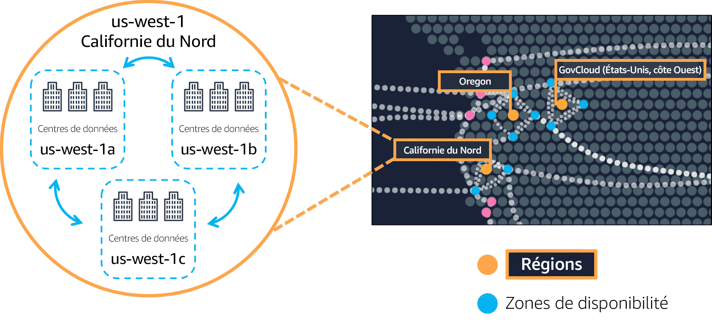
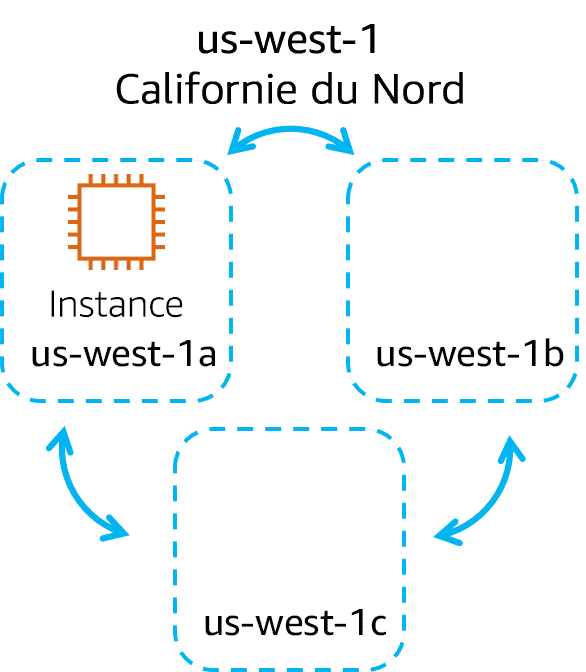
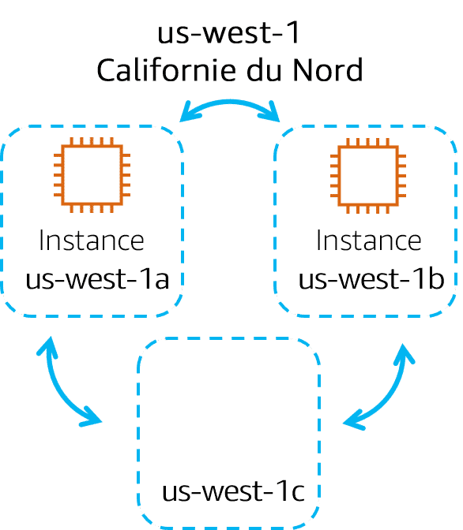
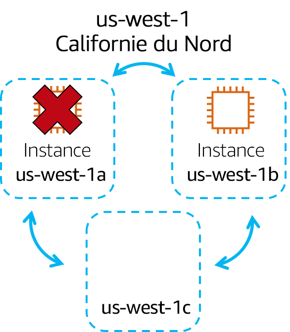
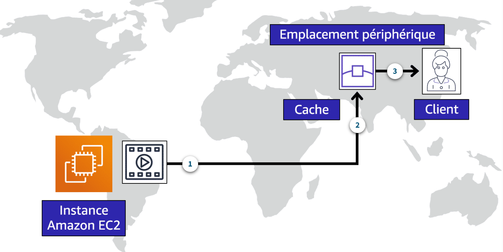
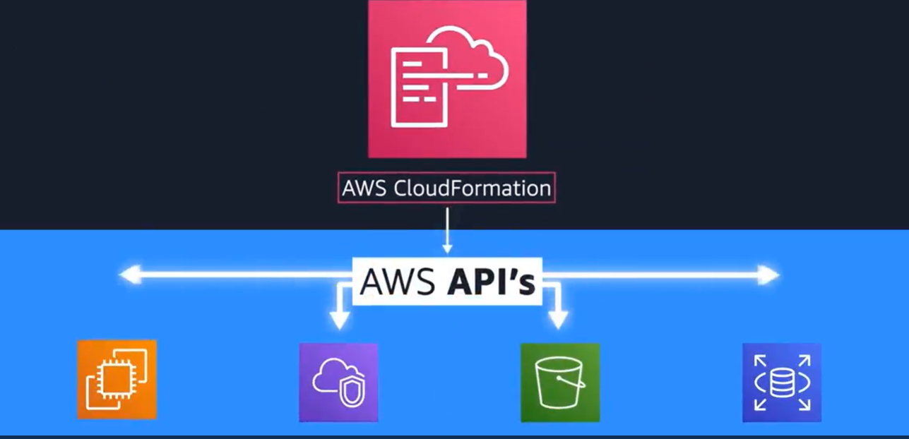
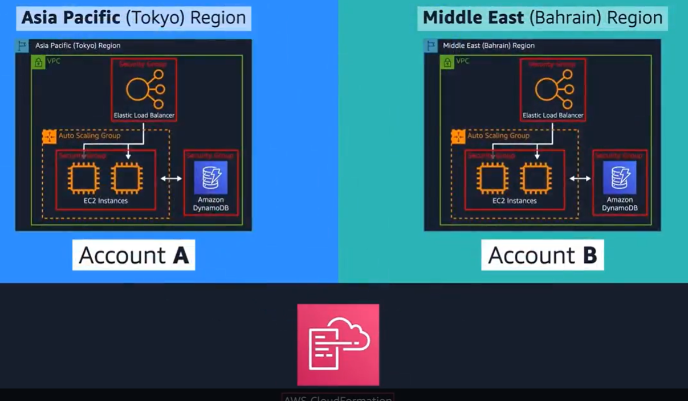

## Introduction du module 3 et objectifs

- Résumer les avantages de l'infrastructure mondiale AWS
- Décrire le concept de base des zones de disponibilité
- Décrire les avantages des emplacements périphériques et d'Amazon CloudFront
- Comparer différentes méthodes d'approvisionnement des services AWS

---

## Régions AWS (33 régions)

infrastructure mondiale 
https://aws.amazon.com/fr/about-aws/global-infrastructure/regions_az/

Pour déterminer la région appropriée pour vos services, données et applications, tenez compte des quatre facteurs commerciaux suivants

- Conformité en matière de gouvernance des données et exigences légales
- Proximité avec vos clients
- Services disponibles dans une région
- Tarification

---

## Zones de disponibilité (105 zones)
Une zone de disponibilité se compose d'un ou pluieurs centres de données

<!-- .element height="55%" width="55%" --> 

Gros plan sur la région us-west 1. La Californie du Nord, l'Oregon et GovCloud (États-Unis, côte Ouest) sont des régions distinctes. La région Californie du Nord est appelée us-west 1, et elle contient trois zones de disponibilité (1a, 1b et 1c). Ensuite, au sein de chaque zone de disponibilité se trouvent trois centres de données.

---

## Instance Amazon EC2 dans une seule zone de disponibilité

<!-- .element height="30%" width="30%" --> 

Supposons que vous exécutez une application sur une seule instance Amazon EC2 dans la région Californie du Nord. L'instance est en cours d'exécution dans la zone de disponibilité us-west-1a. Si us-west-1a échouait, vous perdriez votre instance.

---

## Instances Amazon EC2 dans plusieurs zones de disponibilité

<!-- .element height="30%" width="30%" --> 

Une bonne pratique consiste à exécuter des applications dans au moins deux zones de disponibilité dans une région. Dans cet exemple, vous pouvez choisir d'exécuter une deuxième instance Amazon EC2 dans us-west-1b.

---

## Échec de zone de disponibilité

<!-- .element height="30%" width="30%" --> 

Si us-west-1a échouait, votre application serait toujours en cours d'exécution dans us-west-1b.

---

<!-- .slide: data-auto-animate -->
#### Quiz: Parmi les affirmations suivantes, laquelle décrit le mieux le concept de zones de disponibilité ? <!-- .element: style="color:#fd9731;" -->

- Une zone géographique qui contient des ressources AWS
- Un centre de données unique ou un groupe de centres de données au sein d'une région
- Centre de données utilisé par un service AWS pour effectuer des opérations spécifiques à un service.
- Un service que vous pouvez utiliser pour exécuter l'infrastructure AWS dans votre propre centre de données sur site dans une approche hybride

---

<!-- .slide: data-auto-animate -->
#### Quiz: Parmi les affirmations suivantes, laquelle décrit le mieux le concept de zones de disponibilité ? <!-- .element: style="color:#fd9731;" -->

- Une zone géographique qui contient des ressources AWS
- Un centre de données unique ou un groupe de centres de données au sein d'une région <!-- .element: style="color:#0de07d;" -->
- Centre de données utilisé par un service AWS pour effectuer des opérations spécifiques à un service.
- Un service que vous pouvez utiliser pour exécuter l'infrastructure AWS dans votre propre centre de données sur site dans une approche hybride

---

## Emplacements périphériques : Edge Locations

Un emplacement périphérique est un site qu'Amazon CloudFront utilise afin de stocker des copies mises en cache de votre contenu plus près de vos clients aux fins d'une diffusion plus rapide.

<!-- .element height="50%" width="50%" --> 

---

## Amazon Outposts

- Service qui permet d'étendre les services et l'infrastructure AWS à vos centres de données, espaces colocation, ou sites locaux.
- Il offre une expérience AWS locale et intégrée, permettant de faire tourner des charges de travail sensibles à la latence ou nécessitant une résidence locale des données.
- Mini région AWS, gérée par AWS dans un batiment de l'entreprise du client

---

## Comment interagir avec les services AWS

- Console de gestion AWS : interface visuelle
- Interface de ligne de commande AWS : automatiser des actions
- Kit de développement logiciel : pour les langages de programmation
- AWS Elastic Beanstalk
- AWS CloudFormation

---

## AWS Elastic Beanstalk

Vous fournissez le code et les paramètres de configuration, et Elastic Beanstalk déploie les ressources nécessaires pour effectuer les tâches suivantes :

- Ajustement de la capacité
- Répartition de charge
- Mise à l'échelle automatique
- Surveillance de l'état des applications
- Support multi-langages : Supporte plusieurs langages de programmation et plateformes comme Java, .NET, PHP, Node.js, Python, Ruby, et Go.

---

## AWS CloudFormation

Vous pouvez traiter votre Infrastructure as Code. Cela signifie que vous pouvez créer un environnement en écrivant des lignes de code au lieu d'utiliser la Console de gestion AWS pour mettre en service individuellement des ressources.

AWS CloudFormation met en service vos ressources de manière sûre et reproductible, ce qui vous permet de créer fréquemment votre infrastructure et vos applications sans devoir effectuer des actions manuelles. Il détermine les bonnes opérations à effectuer lors de la gestion de votre pile et annule automatiquement les modifications s'il détecte des erreurs.

---

## AWS CloudFormation

---

## AWS CloudFormation

---

<!-- .slide: data-auto-animate -->
#### Quiz: Quelle affirmation est VRAIE pour l'infrastructure globale AWS ? <!-- .element: style="color:#fd9731;" -->

- Une région se compose d'une seule zone de disponibilité.
- Une zone de disponibilité se compose de deux régions ou plus.
- Une région se compose de trois zones de disponibilité ou plus.
- Une zone de disponibilité se compose d'une seule région.

---

<!-- .slide: data-auto-animate -->
#### Quiz: Quelle affirmation est VRAIE pour l'infrastructure globale AWS ? <!-- .element: style="color:#fd9731;" -->

- Une région se compose d'une seule zone de disponibilité.
- Une zone de disponibilité se compose de deux régions ou plus.
- Une région se compose de trois zones de disponibilité ou plus. <!-- .element: style="color:#0de07d;" -->
- Une zone de disponibilité se compose d'une seule région.

---

<!-- .slide: data-auto-animate -->
#### Quiz: Quels facteurs devraient être pris en compte lors du choix d'une région ? (Sélectionnez DEUX propositions.) <!-- .element: style="color:#fd9731;" -->

- Conformité en matière de gouvernance des données et exigences légales
- Proximité avec vos clients
- Accès à un support technique 24/7
- Possibilité d'attribuer des autorisations personnalisées à différents utilisateurs
- Accès à l'interface de ligne de commande AWS (AWS CLI)

---

<!-- .slide: data-auto-animate -->
#### Quiz: Quels facteurs devraient être pris en compte lors du choix d'une région ? (Sélectionnez DEUX propositions.) <!-- .element: style="color:#fd9731;" -->

- Conformité en matière de gouvernance des données et exigences légales <!-- .element: style="color:#0de07d;" -->
- Proximité avec vos clients <!-- .element: style="color:#0de07d;" -->
- Accès à un support technique 24/7
- Possibilité d'attribuer des autorisations personnalisées à différents utilisateurs
- Accès à l'interface de ligne de commande AWS (AWS CLI)

---

<!-- .slide: data-auto-animate -->
#### Quiz: Quelle affirmation décrit le mieux Amazon CloudFront ? <!-- .element: style="color:#fd9731;" -->

- Un service qui vous permet d'exécuter une infrastructure dans une approche cloud hybride
- Un moteur de calcul serverless pour les conteneurs
- Un service qui vous permet d'envoyer et de recevoir des messages entre les composants logiciels via une file d'attente
- Un service mondial de diffusion de contenu

---

<!-- .slide: data-auto-animate -->
#### Quiz: Quelle affirmation décrit le mieux Amazon CloudFront ? <!-- .element: style="color:#fd9731;" -->

- Un service qui vous permet d'exécuter une infrastructure dans une approche cloud hybride
- Un moteur de calcul serverless pour les conteneurs
- Un service qui vous permet d'envoyer et de recevoir des messages entre les composants logiciels via une file d'attente
- Un service mondial de diffusion de contenu <!-- .element: style="color:#0de07d;" -->

---

<!-- .slide: data-auto-animate -->
#### Quiz: Quel site Amazon CloudFront utilise-t-il pour mettre en cache des copies de contenu pour une livraison plus rapide aux utilisateurs, quel que soit leur emplacement ? <!-- .element: style="color:#fd9731;" -->

- Région
- Zone de disponibilité
- Emplacement périphérique 
- Origine

---

<!-- .slide: data-auto-animate -->
#### Quiz: Quel site Amazon CloudFront utilise-t-il pour mettre en cache des copies de contenu pour une livraison plus rapide aux utilisateurs, quel que soit leur emplacement ? <!-- .element: style="color:#fd9731;" -->

- Région
- Zone de disponibilité
- Emplacement périphérique <!-- .element: style="color:#0de07d;" -->
- Origine

---

<!-- .slide: data-auto-animate -->
#### Quiz: Quelle action pouvez-vous effectuer avec AWS Outposts ? <!-- .element: style="color:#fd9731;" -->

- Automatiser des actions pour des services et applications AWS à l'aide de scripts.
- Accéder à des assistants et à des flux de travail automatisés pour effectuer des tâches dans les services AWS.
- Développer des applications AWS dans des langages de programmation pris en charge.
- Étendre l'infrastructure et les services AWS à différents emplacements, y compris votre centre de données sur site.

---

<!-- .slide: data-auto-animate -->
#### Quiz: Quelle action pouvez-vous effectuer avec AWS Outposts ? <!-- .element: style="color:#fd9731;" -->

- Automatiser des actions pour des services et applications AWS à l'aide de scripts.
- Accéder à des assistants et à des flux de travail automatisés pour effectuer des tâches dans les services AWS.
- Développer des applications AWS dans des langages de programmation pris en charge.
- Étendre l'infrastructure et les services AWS à différents emplacements, y compris votre centre de données sur site. <!-- .element: style="color:#0de07d;" -->