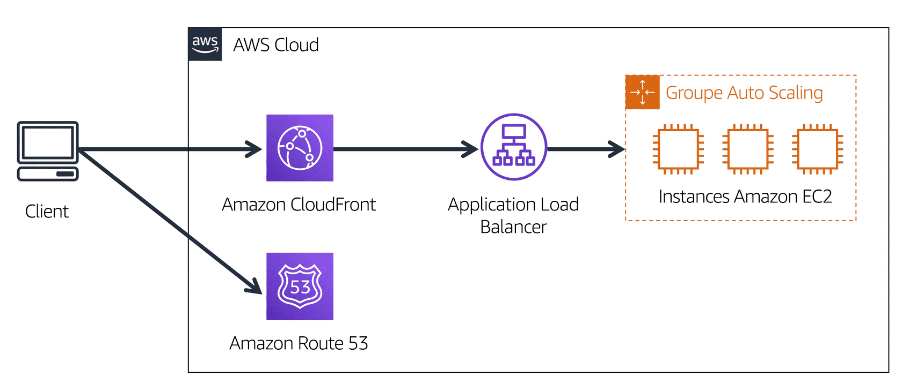

## Introduction du module 3 et objectifs

- Résumer les avantages de l'infrastructure mondiale AWS
- Décrire le concept de base des zones de disponibilité
- Décrire les avantages des emplacements périphériques et d'Amazon CloudFront
- Comparer différentes méthodes d'approvisionnement des services AWS

---

## Régions AWS (33 régions)

infrastructure mondiale 
https://aws.amazon.com/fr/about-aws/global-infrastructure/regions_az/

Pour déterminer la région appropriée pour vos services, données et applications, tenez compte des quatre facteurs commerciaux suivants

- Conformité en matière de gouvernance des données et exigences légales
- Proximité avec vos clients
- Services disponibles dans une région
- Tarification

---

## Zones de disponibilité (105 zones)
Une zone de disponibilité se compose d'un ou pluieurs centres de données

<!-- .element height="55%" width="55%" --> 

Gros plan sur la région us-west 1. La Californie du Nord, l'Oregon et GovCloud (États-Unis, côte Ouest) sont des régions distinctes. La région Californie du Nord est appelée us-west 1, et elle contient trois zones de disponibilité (1a, 1b et 1c). Ensuite, au sein de chaque zone de disponibilité se trouvent trois centres de données.

---

## Instance Amazon EC2 dans une seule zone de disponibilité

<!-- .element height="30%" width="30%" --> 

Supposons que vous exécutez une application sur une seule instance Amazon EC2 dans la région Californie du Nord. L'instance est en cours d'exécution dans la zone de disponibilité us-west-1a. Si us-west-1a échouait, vous perdriez votre instance.

---

## Instances Amazon EC2 dans plusieurs zones de disponibilité

<!-- .element height="30%" width="30%" --> 

Une bonne pratique consiste à exécuter des applications dans au moins deux zones de disponibilité dans une région. Dans cet exemple, vous pouvez choisir d'exécuter une deuxième instance Amazon EC2 dans us-west-1b.

---

## Échec de zone de disponibilité

<!-- .element height="30%" width="30%" --> 

Si us-west-1a échouait, votre application serait toujours en cours d'exécution dans us-west-1b.

---

Quiz

---

## Emplacements périphériques : Edge Locations

Un emplacement périphérique est un site qu'Amazon CloudFront utilise afin de stocker des copies mises en cache de votre contenu plus près de vos clients aux fins d'une diffusion plus rapide.

<!-- .element height="50%" width="50%" --> 

---

## Amazon Cloudfront

<!-- .element height="43%" width="43%" --> 

- Un client demande des données à partir de l'application en se rendant sur le site web de l'entreprise X.
- Amazon Route 53 utilise la résolution DNS pour identifier l'adresse IP correspondante au site web de l'entreprise X,192.0.2.0. Ces informations sont renvoyées au client. 
- La requête du client est envoyée vers l'emplacement périphérique le plus proche via Amazon CloudFront. 
- Amazon CloudFront se connecte à l'Application Load Balancer, qui envoie le paquet entrant à une instance Amazon EC2.

---

## Amazon Route 53

- Service de nom de domaine (DNS) évolutif et hautement disponible
- traduit le nom du site web a une adresse IP
- Il connecte les requêtes des utilisateurs aux infrastructures AWS telles que les instances Amazon EC2, les équilibreurs de charge, et Amazon S3.
- Politiques de routage:
  * Routage basée sur la latence
  * Geolocation DNS
  * Geoproximity routing
  * Weighted round robin
---

## Amazon Outposts

- Service qui permet d'étendre les services et l'infrastructure AWS à vos centres de données, espaces colocation, ou sites locaux.
- Il offre une expérience AWS locale et intégrée, permettant de faire tourner des charges de travail sensibles à la latence ou nécessitant une résidence locale des données.
- Mini région AWS, gérée par AWS dans un baticment de l'entreprise du client

---

## Comment interagir avec les services AWS

- Console de gestion AWS : interface visuelle
- Interface de ligne de commande AWS : automatiser des actions
- Kit de développement logiciel : pour les langages de programmation
- AWS Elastic Beanstalk
- AWS CloudFormation

---

## AWS Elastic Beanstalk

Vous fournissez le code et les paramètres de configuration, et Elastic Beanstalk déploie les ressources nécessaires pour effectuer les tâches suivantes :

- Ajustement de la capacité
- Répartition de charge
- Mise à l'échelle automatique
- Surveillance de l'état des applications
- Support multi-langages : Supporte plusieurs langages de programmation et plateformes comme Java, .NET, PHP, Node.js, Python, Ruby, et Go.

---

## AWS CloudFormation

Vous pouvez traiter votre Infrastructure as Code. Cela signifie que vous pouvez créer un environnement en écrivant des lignes de code au lieu d'utiliser la Console de gestion AWS pour mettre en service individuellement des ressources.

AWS CloudFormation met en service vos ressources de manière sûre et reproductible, ce qui vous permet de créer fréquemment votre infrastructure et vos applications sans devoir effectuer des actions manuelles. Il détermine les bonnes opérations à effectuer lors de la gestion de votre pile et annule automatiquement les modifications s'il détecte des erreurs.

---

## AWS CloudFormation

---

## AWS CloudFormation

---

Quiz
