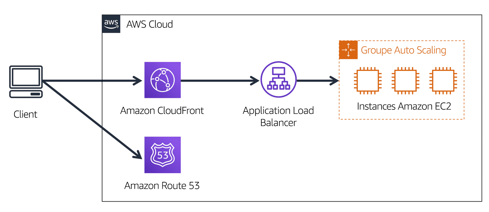

## Introduction du module 4 et objectifs

- Concepts de base de la mise en réseau
- Différence entre des ressources de mise en réseaux publics et privés 
- Passerelle de réseau privé virtuel
- Réseau privé virtuel (VPN)
- Avantages d'AWS Direct Connect 
- Avantages des déploiements hybrides 
- Couches de sécurité utilisées dans une stratégie informatique
- Services que les clients utilisent pour interagir avec le réseau mondial AWS

---

## Amazon VPC (Virtual Private Cloud)

- service de mise en réseau que vous pouvez utiliser pour établir des limites autour de vos ressources AWS.
- mettre en service une section isolée du Cloud AWS. Dans cette section isolée, vous pouvez lancer des ressources dans un réseau virtuel que vous définissez. Dans un cloud privé virtuel (VPC), vous pouvez organiser vos ressources en sous-réseaux. Un sous-réseau est une section d'un VPC qui peut contenir des ressources telles que des instances Amazon EC2.

---

## Amazon VPC (Virtual Private Cloud)

<!-- .element height="55%" width="55%" --> 

---

## Passerelle Internet (Internet Gateway)

Pour autoriser le trafic public à partir d'Internet à accéder à votre VPC, associez une passerelle Internet au VPC.

<!-- .element height="55%" width="55%" --> 

---

## Passerelle de réseau privé virtuel (Virtual Private Gateway)

- Une passerelle de réseau privé virtuel vous permet d'établir une connexion de réseau privé virtuel (VPN) entre votre VPC et un réseau privé, tel qu'un centre de données sur site ou un réseau interne d'entreprise. 
- Une passerelle réseau privé virtuel autorise le trafic vers le VPC uniquement s'il provient d'un réseau approuvé.

<!-- .element height="55%" width="55%" --> 

## AWS Direct Connect

-  Service qui vous permet d'établir une connexion privée dédiée entre votre centre de données et un VPC

<!-- .element height="55%" width="55%" --> 

---

## AWS Direct Connect : Details

<!-- .element height="55%" width="55%" --> 

---

## Sous-réseaux

- Un sous-réseau est une section d'un VPC dans laquelle vous pouvez regrouper des ressources en fonction des besoins de sécurité ou opérationnels. Les sous-réseaux peuvent être publics ou privés.
- Les sous-réseaux publics contiennent des ressources qui doivent être accessibles au public, telles que le site web d'une boutique en ligne.
- Les sous-réseaux privés contiennent des ressources qui ne doivent être accessibles que par l'intermédiaire de votre réseau privé, par exemple une base de données contenant les informations personnelles des clients et l'historique des commandes. 
- Dans un VPC, les sous-réseaux peuvent communiquer entre eux. Par exemple, vous pouvez avoir une application qui implique des instances Amazon EC2 dans un sous-réseau public communiquant avec des bases de données situées dans un sous-réseau privé.

---

## Sous-réseaux : Suite

<!-- .element height="55%" width="55%" --> 

---

## ACL réseau : schéma du principe

<!-- .element height="55%" width="55%" --> 

---

## ACL réseau

- Une liste de contrôle d'accès (ACL) réseau est un pare-feu virtuel qui contrôle le trafic entrant et sortant au niveau des sous-réseaux
- Chaque compte AWS inclut une liste ACL réseau par défaut
- Lors de la configuration de votre VPC, vous pouvez utiliser la liste ACL réseau par défaut de votre compte ou créer des listes ACL réseau personnalisées. 
- La liste ACL réseau par défaut de votre compte autorise tout le trafic entrant et sortant
-  Pour les ACL réseau personnalisées, tout le trafic entrant et sortant est refusé jusqu'à ce que vous ajoutiez des règles pour spécifier le trafic à autoriser
- Les listes ACL réseau effectuent un filtrage des paquets **sans état (stateless)** Ils ne se souviennent de rien et vérifient les paquets qui traversent la frontière du sous-réseau dans les deux sens : entrants et sortants. 
- Une fois qu'un paquet est entré dans un sous-réseau, ses autorisations doivent être évaluées pour les ressources du sous-réseau, telles que les instances Amazon EC2. 

---

## Groupe de sécurité : schéma du principe

<!-- .element height="55%" width="55%" --> 

---

## Groupe de sécurité

- Un groupe de sécurité est un pare-feu virtuel qui contrôle le trafic entrant et sortant d'une instance Amazon EC2.
- Par défaut, un groupe de sécurité refuse tout le trafic entrant et autorise tout le trafic sortant.
- Si vous avez plusieurs instances Amazon EC2 au sein d'un même VPC, vous pouvez les associer au même groupe de sécurité ou utiliser des groupes de sécurité différents pour chaque instance. 
- Les groupes de sécurité effectuent un filtrage des paquets avec état. Ils se souviennent des décisions antérieures prises pour les paquets entrants.

---

## Groupe de sécurité vs ACL

<!-- .element height="55%" width="55%" --> 

---

## Simulation d'un paquet qui part d'une instance A à une instance B dans deux sous réseaux différents d'un même VPC

<!-- .element height="55%" width="55%" --> 

---

<!-- .slide: data-auto-animate -->
#### Quiz: Quelle affirmation décrit le mieux la liste de contrôle d'accès au réseau par défaut d'un compte AWS ? <!-- .element: style="color:#fd9731;" -->

- Il est sans état et refuse tout le trafic entrant et sortant.
- Il est avec état et autorise tout le trafic entrant et sortant.
- Il est sans état et autorise tout le trafic entrant et sortant.
- Il est avec état et refuse tout le trafic entrant et sortant.

---

<!-- .slide: data-auto-animate -->
#### Quiz: Quelle affirmation décrit le mieux la liste de contrôle d'accès au réseau par défaut d'un compte AWS ? <!-- .element: style="color:#fd9731;" -->

- Il est sans état et refuse tout le trafic entrant et sortant.
- Il est avec état et autorise tout le trafic entrant et sortant.
- Il est sans état et autorise tout le trafic entrant et sortant. <!-- .element: style="color:#0de07d;" -->
- Il est avec état et refuse tout le trafic entrant et sortant.

---

## Amazon Cloudfront

<!-- .element height="43%" width="43%" --> 

- Un client demande des données à partir de l'application en se rendant sur le site web de l'entreprise X.
- Amazon Route 53 utilise la résolution DNS pour identifier l'adresse IP correspondante au site web de l'entreprise X,192.0.2.0. Ces informations sont renvoyées au client. 
- La requête du client est envoyée vers l'emplacement périphérique le plus proche via Amazon CloudFront. 
- Amazon CloudFront se connecte à l'Application Load Balancer, qui envoie le paquet entrant à une instance Amazon EC2.

---

## Amazon Route 53

- Service de nom de domaine (DNS) évolutif et hautement disponible
- traduit le nom du site web a une adresse IP
- Il connecte les requêtes des utilisateurs aux infrastructures AWS telles que les instances Amazon EC2, les équilibreurs de charge, et Amazon S3.
- Politiques de routage:
  * Routage basée sur la latence
  * Geolocation DNS
  * Geoproximity routing
  * Weighted round robin

---

<!-- .slide: data-auto-animate -->
#### Quiz: Quelle affirmation décrit le mieux la résolution DNS ? <!-- .element: style="color:#fd9731;" -->

- Lancement de ressources dans un réseau virtuel que vous définissez
- Stockage de copies locales de contenu dans des emplacements périphériques à travers le monde
- Connexion d'un VPC à Internet
- Conversion d'un nom de domaine vers une adresse IP

---

<!-- .slide: data-auto-animate -->
#### Quiz: Quelle affirmation décrit le mieux la résolution DNS ? <!-- .element: style="color:#fd9731;" -->

- Lancement de ressources dans un réseau virtuel que vous définissez
- Stockage de copies locales de contenu dans des emplacements périphériques à travers le monde
- Connexion d'un VPC à Internet
- Conversion d'un nom de domaine vers une adresse IP <!-- .element: style="color:#0de07d;" -->

---

<!-- .slide: data-auto-animate -->
#### Quiz: Votre entreprise dispose d'une application qui utilise des instances Amazon EC2 pour exécuter le site web client et les instances de base de données Amazon RDS afin de stocker les informations personnelles des clients. Comment le développeur doit-il configurer le VPC selon les bonnes pratiques ? <!-- .element: style="color:#fd9731;" -->

- En plaçant les instances Amazon EC2 dans un sous-réseau privé et les instances de base de données Amazon RDS dans un sous-réseau public.
- En plaçant les instances Amazon EC2 dans un sous-réseau public et les instances de base de données Amazon RDS dans un sous-réseau privé.
- En plaçant les instances Amazon EC2 et les instances de base de données Amazon RDS dans un sous-réseau public.
- En plaçant les instances Amazon EC2 et les instances de base de données Amazon RDS dans un sous-réseau privé.

---

<!-- .slide: data-auto-animate -->
#### Quiz: Votre entreprise dispose d'une application qui utilise des instances Amazon EC2 pour exécuter le site web client et les instances de base de données Amazon RDS afin de stocker les informations personnelles des clients. Comment le développeur doit-il configurer le VPC selon les bonnes pratiques ? <!-- .element: style="color:#fd9731;" -->

- En plaçant les instances Amazon EC2 dans un sous-réseau privé et les instances de base de données Amazon RDS dans un sous-réseau public.
- En plaçant les instances Amazon EC2 dans un sous-réseau public et les instances de base de données Amazon RDS dans un sous-réseau privé. <!-- .element: style="color:#0de07d;" -->
- En plaçant les instances Amazon EC2 et les instances de base de données Amazon RDS dans un sous-réseau public.
- En plaçant les instances Amazon EC2 et les instances de base de données Amazon RDS dans un sous-réseau privé.

---

<!-- .slide: data-auto-animate -->
#### Quiz: Quel composant peut être utilisé pour établir une connexion privée dédiée entre le centre de données de votre entreprise et AWS ? <!-- .element: style="color:#fd9731;" -->

- Sous-réseau privé
- DNS
- AWS Direct Connect
- Passerelle de réseau privé virtuel

--- 

<!-- .slide: data-auto-animate -->
#### Quiz: Quel composant peut être utilisé pour établir une connexion privée dédiée entre le centre de données de votre entreprise et AWS ? <!-- .element: style="color:#fd9731;" -->

- Sous-réseau privé
- DNS
- AWS Direct Connect <!-- .element: style="color:#0de07d;" -->
- Passerelle de réseau privé virtuel
  
---

<!-- .slide: data-auto-animate -->
#### Quiz: Quelle affirmation décrit le mieux les groupes de sécurité ? <!-- .element: style="color:#fd9731;" -->

- Ils sont avec état et refusent tout le trafic entrant par défaut.
- Ils sont avec état et autorisent tout le trafic entrant par défaut.
- Ils sont sans état et refusent tout le trafic entrant par défaut.
- Ils sont sans état et autorisent tout le trafic entrant par défaut.

---

<!-- .slide: data-auto-animate -->
#### Quiz: Quelle affirmation décrit le mieux les groupes de sécurité ? <!-- .element: style="color:#fd9731;" -->

- Ils sont avec état et refusent tout le trafic entrant par défaut. <!-- .element: style="color:#0de07d;" -->
- Ils sont avec état et autorisent tout le trafic entrant par défaut.
- Ils sont sans état et refusent tout le trafic entrant par défaut.
- Ils sont sans état et autorisent tout le trafic entrant par défaut.

---

<!-- .slide: data-auto-animate -->
#### Quiz: Quel composant est utilisé pour connecter un VPC à Internet ? <!-- .element: style="color:#fd9731;" -->

- Sous-réseau public
- Emplacement périphérique
- Groupe de sécurité
- Passerelle Internet

---

<!-- .slide: data-auto-animate -->
#### Quiz: Quel composant est utilisé pour connecter un VPC à Internet ? <!-- .element: style="color:#fd9731;" -->

- Sous-réseau public
- Emplacement périphérique
- Groupe de sécurité
- Passerelle Internet <!-- .element: style="color:#0de07d;" -->

---

<!-- .slide: data-auto-animate -->
#### Quiz: Quel service est utilisé pour gérer les enregistrements DNS pour les noms de domaine ? <!-- .element: style="color:#fd9731;" -->

- Amazon Virtual Private Cloud
- AWS Direct Connect
- Amazon CloudFront
- Amazon Route 53

---

<!-- .slide: data-auto-animate -->
#### Quiz: Quel service est utilisé pour gérer les enregistrements DNS pour les noms de domaine ? <!-- .element: style="color:#fd9731;" -->

- Amazon Virtual Private Cloud
- AWS Direct Connect
- Amazon CloudFront
- Amazon Route 53 <!-- .element: style="color:#0de07d;" -->
