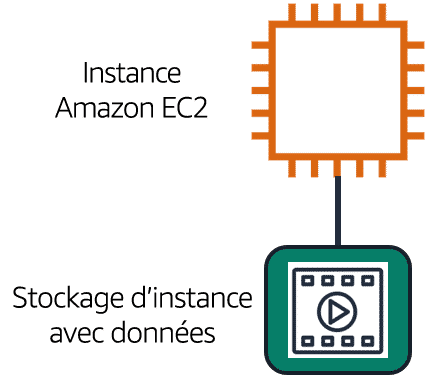
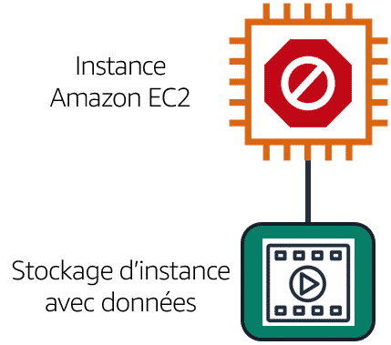
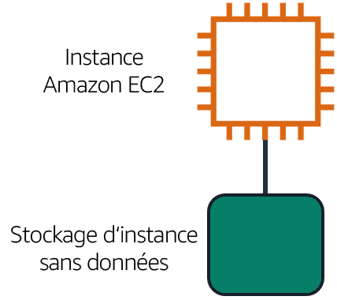
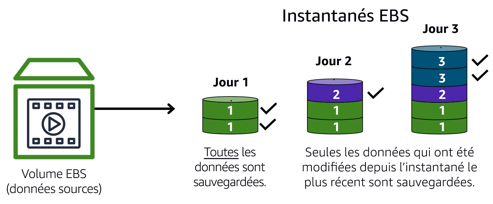
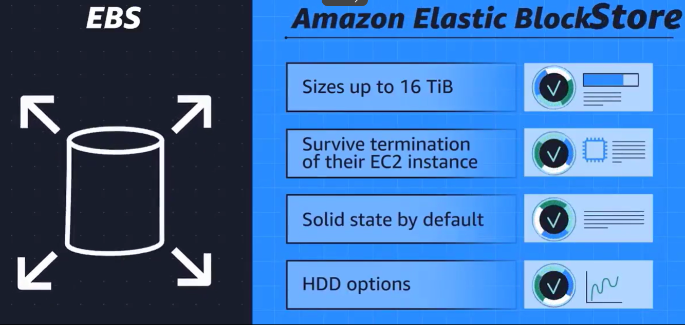
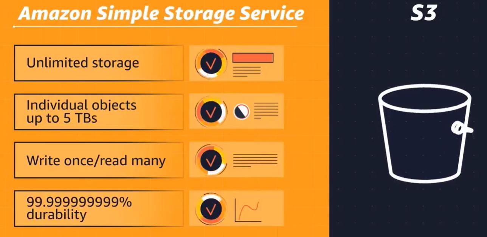
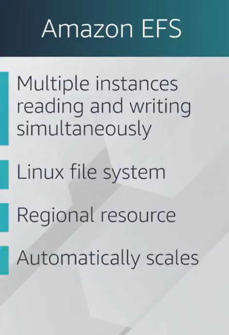
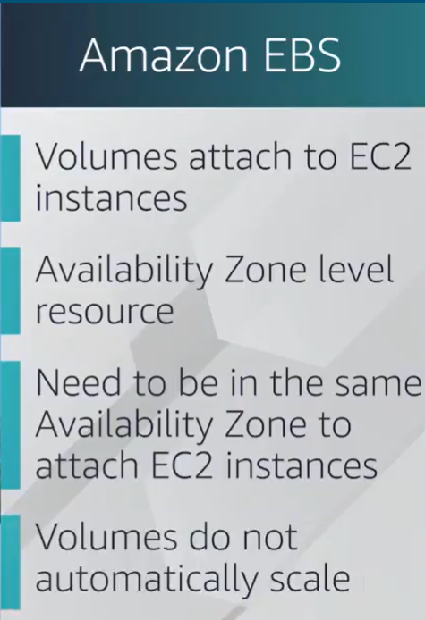
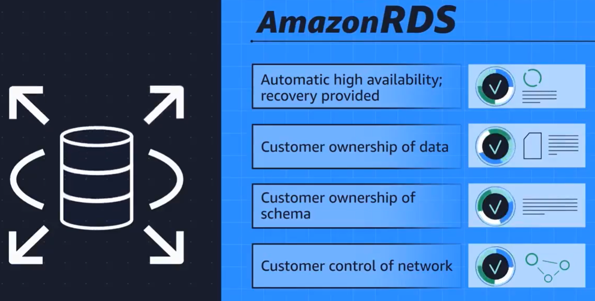
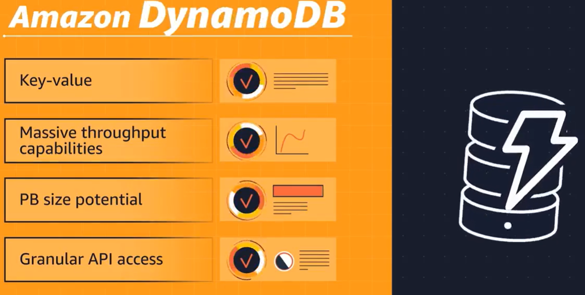

## Introduction du module 5 et objectifs

- concept de base du stockage et des bases de données ;
- avantages d'Amazon Elastic Block Store (Amazon EBS) ;
- avantages d'Amazon Simple Storage Solution (Amazon S3) ;
- avantages d'Amazon Elastic File System (Amazon EFS) ;
- différentes solutions de stockage ;
- avantages d'Amazon Relational Database Service (RDS) ;
- avantages d'Amazon DynamoDB ;

---

## Stockages d'instances 

- Fournit un stockage temporaire de niveau bloc pour une instance Amazon EC2. 
- Un stockage d'instance désigne un stockage sur disque qui est physiquement connecté à l'ordinateur hôte pour une instance EC2 et qui possède donc la même durée de vie que l'instance. 
- Lorsque l'instance est résiliée, vous perdez toutes les données du stockage d'instance.

---

## Stockages d'instances : suite

|   |  |  |
|:-------------------------:|:-------------------------:|:---------------------------:|
| Une instance Amazon EC2 avec un stockage d'instances attaché est en cours d'exécution <!-- .element: style="font-size:50%; color:#FFFFFF" -->  |  L'instance est arrêtée ou résiliée <!-- .element: style="font-size:50%; color:#FFFFFF" -->  | Toutes les données du stockage d'instance attaché sont supprimées <!-- .element: style="font-size:50%; color:#FFFFFF" -->  |  
|<!-- .element height="80%" width="80%" -->  |  <!-- .element height="80%" width="80%" --> | <!-- .element height="80%" width="80%" --> |

---

## Amazon Elastic Block Store (Amazon EBS)

- Service fournissant des volumes de stockage au niveau bloc pour une utilisation avec des instances Amazon EC2.
- Les données restent disponibles même si une instance EC2 est arrêtée ou résiliée.
- **Création de Volumes EBS** :
  - Définissez la configuration (taille, type) du volume EBS et mettez-le en service.
  - Une fois créé, un volume EBS peut être attaché à une instance EC2.
- **Sauvegarde des Données** :
  - Les volumes EBS sont destinés à des données devant être conservées, il est donc important de sauvegarder les données.
  - Les sauvegardes progressives peuvent être effectuées en créant des instantanés Amazon EBS.

---

## Instantanés Amazon EBS

---

## Instantanés Amazon EBS : Suite

- Un instantané EBS(opens in a new tab) est une sauvegarde progressive. Cela signifie que la première sauvegarde d'un volume copie toutes les données. Pour les sauvegardes suivantes, seuls les blocs de données qui ont été modifiés depuis le dernier instantané sont enregistrés. 
- Les sauvegardes progressives sont différentes des sauvegardes complètes, dans lesquelles toutes les données d'un volume de stockage sont copiées à chaque sauvegarde. La sauvegarde complète inclut les données qui n'ont pas été modifiées depuis la dernière sauvegarde.

---

## Stockage objet

<!-- .element height="40%" width="40%" --> 

- chaque objet se compose de données, de métadonnées et d'une clé.
- Les données peuvent être une image, une vidéo, un document texte ou tout autre type de fichier. 
- Les métadonnées contiennent des informations sur les données, leur utilisation, la taille de l'objet, etc. La clé d'un objet est son identifiant unique.

---

## Amazon Simple Storage Service (Amazon S3)

Rappelons que lorsque vous modifiez un fichier dans un stockage en bloc, seules les pièces qui ont été modifiées sont mises à jour. Lorsqu'un fichier dans le stockage d'objets est modifié, l'objet entier est mis à jour.

---

## Amazon S3 : suite

- Service fournissant un stockage au niveau objet.
- Peut stocker différents types de fichiers tels que des images, des vidéos, des fichiers texte, etc.
- Utilisation possible pour des fichiers de sauvegarde, des médias pour un site web, ou des documents archivés.
- Offre un espace de stockage illimité.
- Taille maximale de fichier pour un objet : 5 To.
- Autorisations pouvant être définies pour contrôler la visibilité et l'accès des fichiers.
- Fonctionnalité de gestion des versions permettant de suivre les modifications apportées aux objets au fil du temps.

---

## Classes de stockage Amazon S3

- S3 Standard
- S3 Standard – Accès peu fréquent
- S3 One Zone – Accès peu fréquent
- S3 Intelligent-Tiering
- S3 Glacier Instant Retrieval
- S3 Glacier Flexible Retrieval
- S3 Glacier Deep Archive
- S3 Outposts

---

## S3 Standard

- Conçu pour les données fréquemment consultées
- Stockage dans un minimum de trois zones de disponibilité
- Disponibilité élevée pour les objets
  - Bon choix pour un large éventail de cas d'utilisation comme les sites web, la distribution de contenu, et l'analytique des données.
- Coût plus élevé que les autres classes de stockage
  - Destiné aux données fréquemment consultées, pas aux données rarement consultées ou au stockage d'archives.

---

## S3 Standard – Accès peu fréquent

- Idéal pour les données rarement consultées
- Semblable à Amazon S3 standard, mais proposé à un prix de stockage inférieur et à un prix de récupération plus élevé

---

## S3 One Zone – Accès peu fréquent

- Stocke les données dans une zone de disponibilité unique
- Prix de stockage inférieur à Amazon S3 standard – Accès peu fréquent

---

## S3 Intelligent-Tiering

- Idéal pour les données avec des modèles d'accès inconnus ou changeants
- Nécessite des frais mensuels de surveillance et d'automatisation par objet

Dans la classe de stockage S3 Intelligent-Tiering, Amazon S3 surveille les modèles d'accès des objets. Si vous n'avez pas accédé à un objet pendant 30 jours consécutifs, Amazon S3 le déplace automatiquement vers le niveau d'accès peu fréquent, S3 Standard – Accès peu fréquent. Si vous accédez à un objet du niveau d'accès peu fréquent, Amazon S3 le déplace automatiquement vers le niveau d'accès fréquent, S3 Standard.

---

## S3 Glacier Instant Retrieval

- Idéal pour les données d'archives qui nécessitent un accès immédiat
- Capable de récupérer des objets en quelques millisecondes

Lorsque vous choisissez l'une des options pour le stockage d'archives, tenez compte de la rapidité avec laquelle vous devez récupérer les objets archivés. Vous pouvez récupérer des objets stockés dans la classe de stockage Amazon S3 Glacier Instant Retrieval en quelques millisecondes, avec les mêmes performances que S3 Standard.

---

## S3 Glacier Flexible Retrieval

- Stockage économique conçu pour l'archivage des données
- Capable de récupérer des objets entre quelques minutes et quelques heures

S3 Glacier Flexible Retrieval est une classe de stockage économique idéale pour l'archivage des données. Par exemple, vous pouvez utiliser cette classe de stockage pour stocker des dossiers clients archivés ou des photos et des fichiers vidéo plus anciens. Vous pouvez récupérer vos données à partir de S3 Glacier Flexible Retrieval entre 1 minute et 12 heures.

---

## S3 Glacier Deep Archive

- Classe de stockage la moins chère pour l'archivage
- Capable de récupérer des objets dans un délai de 12 heures

S3 Deep Archive prend en charge la rétention à long terme et la préservation numérique des données qui peuvent être consultées une ou deux fois par an. Cette classe de stockage est le stockage le moins cher dans le Cloud AWS, avec une récupération des données entre 12 et 48 heures. Tous les objets de cette classe de stockage sont répliqués et stockés dans au moins trois zones de disponibilité géographiquement dispersées.

---

## S3 Outposts

- Crée des compartiments S3 dans Amazon S3 Outposts
- Facilite la récupération, le stockage et l'accès aux données sur AWS Outposts

Amazon S3 Outposts fournit un stockage d'objets à votre environnement AWS Outposts sur site. Amazon S3 Outposts est conçu pour stocker des données durablement et de manière redondante sur plusieurs appareils et serveurs sur vos Outposts. Il convient particulièrement aux charges de travail avec des exigences en matière de résidence des données locales qui doivent satisfaire les besoins de performances en gardant les données proches des applications sur site.

---

## Comparaison entre EBS et S3

|   |  | 
|:-------------------------:|:-------------------------:|
|  |   | 

---

## Amazon Elastic File System (Amazon EFS)

- Service de stockage de fichiers entièrement géré et évolutif, conçu pour les charges de travail sur Amazon EC2.
- Offre un stockage partagé dans le cloud, accessible simultanément depuis plusieurs instances EC2, permettant le partage de données entre les instances.
- Elasticité : L'espace de stockage s'ajuste automatiquement en fonction des besoins de la charge de travail
- Haute Disponibilité : Conçu pour une disponibilité élevée avec une redondance intégrée et une tolérance aux pannes.
- Performance : Offre des performances fiables et évolutives pour les charges de travail nécessitant un accès à faible latence aux fichiers.

---

## Comparaison entre EFS et EBS

|   |  | 
|:-------------------------:|:-------------------------:|
|<!-- .element height="50%" width="50%" -->   |  <!-- .element height="50%" width="50%" -->  | 

---

## Amazon Relational Database Service (Amazon RDS)

- Permet d'exécuter des bases de données relationnelles dans le Cloud AWS.
- Service géré automatisant les tâches telles que la mise en service du matériel, la configuration des bases de données, les correctifs et les sauvegardes.
- Simplicité de Gestion: Réduit le temps consacré aux tâches administratives, libérant ainsi du temps pour l'innovation des applications.
- Peut être intégré à d'autres services comme AWS Lambda pour répondre aux besoins commerciaux et opérationnels.
- Options de Sécurité: Propose plusieurs options de sécurité, y compris le chiffrement au repos et le chiffrement en transit pour protéger les données stockées et en cours de transmission.

---

## Moteurs de base de données Amazon RDS

Amazon RDS est disponible sur six moteurs de bases de données, qui optimisent la mémoire, les performances ou les entrées/sorties (E/S). Les moteurs de bases de données pris en charge comprennent :

- Amazon Aurora
- PostgreSQL
- MySQL
- MariaDB
- Oracle Database
- Microsoft SQL Server

---

## Amazon Aurora

- Base de données relationnelle de classe entreprise compatible avec MySQL et PostgreSQL.
- Offre jusqu'à cinq fois plus de vitesse que MySQL standard et jusqu'à trois fois plus de vitesse que PostgreSQL standard.
- Assure une disponibilité élevée en répliquant six copies des données sur trois zones de disponibilité et en effectuant des sauvegardes continues sur Amazon S3.

---

## Amazon DynamoDB

- Service de base de données clé-valeur de type NoSQL. Il assure des performances inférieures à 10 millisecondes à n'importe quelle échelle.
- DynamoDB est serverless, ce qui signifie que vous ne devez pas mettre en service, corriger ou gérer de serveurs. 
- Vous n'avez pas non plus besoin d'installer, de maintenir ou d'utiliser un logiciel.
- À mesure que la taille de votre base de données augmente ou diminue, DynamoDB se met automatiquement à l'échelle pour s'adapter aux changements de capacité, tout en assurant des performances constantes.

---

## Comparaison entre RDS et DynamoDB

|   |  | 
|:-------------------------:|:-------------------------:|
|   |    | 

---

## Amazon Redshift

- Service de data warehousing entièrement géré par AWS.
- Conçu pour l'analyse de données à grande échelle, offrant des performances rapides et évolutives pour les requêtes SQL complexes.
- Utilise une architecture massivement parallèle pour traiter de grands ensembles de données et offre des fonctionnalités de compression, de sauvegarde et de sécurité avancées.

---

## AWS Database Migration Service

- Simplifie la migration entre divers types de bases de données relationnelles, non relationnelles et autres types de stockages de données. 
- Permet de déplacer les données entre une source et une cible, même si elles sont de types différents, tout en maintenant la disponibilité opérationnelle de la base de données pendant la migration. Par exemple, vous pouvez migrer des données d'une base de données MySQL stockée localement vers une base de données Amazon Aurora dans le cloud grâce à AWS DMS, réduisant ainsi les temps d'arrêt des applications associées à la base de données.
- Consolidation de bases de données
- Réplication en continu : Envoyer des copies continues de vos données vers d'autres sources cibles au lieu d'effectuer une migration ponctuelle

---

## Services de bases de données supplémentaires

---

## Amazon DocumentDB

- Service de base de données de documents qui prend en charge les charges de travail MongoDB. (MongoDB est un programme de base de données de documents.)

---

## Amazon Neptune

- Amazon Neptune est un service de base de données graphique. 
- Vous pouvez utiliser Amazon Neptune pour créer et exécuter des applications qui fonctionnent avec des jeux de données hautement connectés, tels que les moteurs de recommandation, la détection des fraudes et les graphiques de connaissances.

---

## Amazon Quantum Ledger Database (Amazon QLDB)

- Service de base de données de registre. cela signifie qu'elle est conçue pour stocker des données de manière immuable et vérifiable.
- Vous pouvez utiliser Amazon QLDB pour consulter un historique complet de toutes les modifications apportées aux données de votre application.

---

## Amazon Managed Blockchain

- Service pour créer et gérer des réseaux blockchain avec des frameworks open source. 
- Blockchain est un système de registre distribué qui permet à plusieurs parties d'exécuter des transactions et de partager des données sans autorité centrale.

---

## Amazon ElastiCache

- Service qui ajoute des couches de mise en cache au-dessus de vos bases de données afin d'améliorer les temps de lecture des requêtes courantes. 
- Il prend en charge deux types de magasins de données : Redis et Memcached.

---

## Amazon DynamoDB Accelerator

- DAX est un cache en mémoire pour DynamoDB. 
- Ce service fait passer les temps de réponse de 1 à 9 millisecondes à quelques microsecondes.

