## Introduction du module 6 et objectifs

- Modèle de responsabilité partagée ;
- Authentification multifactorielle (MFA, Multi-Factor Authentication) ;
- Niveaux de sécurité AWS Identity and Access Management (IAM).
- Principaux avantages d'AWS Organizations ;
- Bases des stratégies de sécurité ;
- Avantages de la conformité avec AWS ;
- Bases des services de sécurité AWS supplémentaires.

---

## Modèle de responsabilité partagée

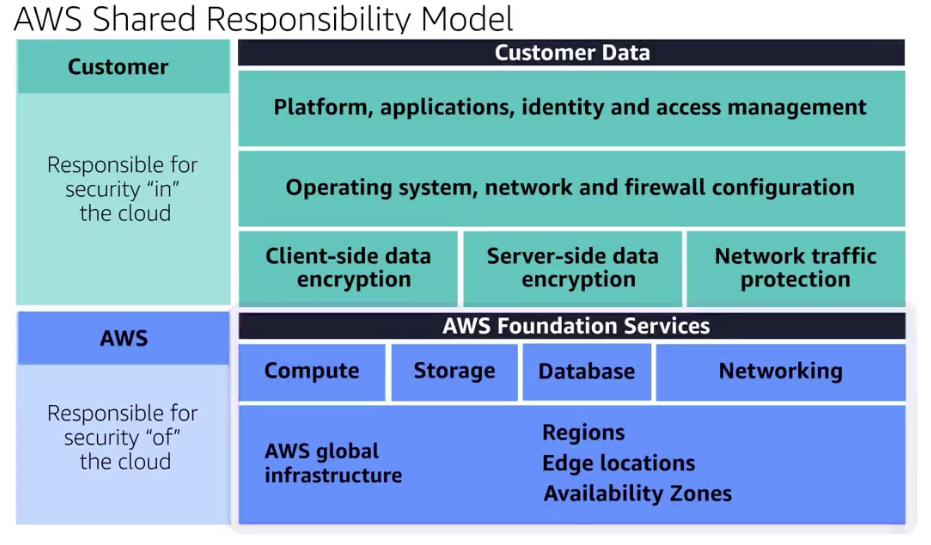

---

## Exemple avec EC2

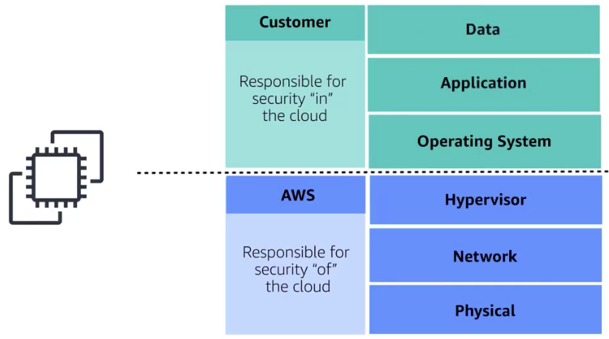

---

## Responsabilité partagée

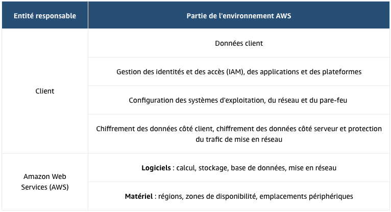

---

<!-- .slide: data-auto-animate -->
#### Quiz: Quelles sont les tâches qui incombent aux clients ? (Sélectionnez DEUX propositions.) <!-- .element: style="color:#fd9731;" -->

- Maintien de l'infrastructure réseau
- Application de correctifs logiciels sur les instances Amazon EC2
- Implémentation de contrôles de sécurité physique dans les centres de données
- Définition des autorisations pour les objets Amazon S3
- Gestion des serveurs qui exécutent des instances Amazon EC2

---

<!-- .slide: data-auto-animate -->
#### Quiz: Quelles sont les tâches qui incombent aux clients ? (Sélectionnez DEUX propositions.) <!-- .element: style="color:#fd9731;" -->

- Maintien de l'infrastructure réseau
- Application de correctifs logiciels sur les instances Amazon EC2 <!-- .element: style="color:#0de07d;" -->
- Implémentation de contrôles de sécurité physique dans les centres de données
- Définition des autorisations pour les objets Amazon S3 <!-- .element: style="color:#0de07d;" -->
- Gestion des serveurs qui exécutent des instances Amazon EC2

---

## Autorisations et accès utilisateur

---

## Gestion des identités et des accès AWS (AWS IAM)

AWS IAM : AWS Identity and Access Management
- Permet de gérer, de façon sécurisée, l'accès aux services et ressources AWS.   
- Offre la flexibilité nécessaire pour configurer l'accès en fonction des besoins opérationnels et de sécurité spécifiques de votre entreprise. 
  - Utilisateurs, groupes et rôles IAM
  - Stratégies IAM
  - Authentification multifactorielle

---

## Utilisateur racine d'un compte AWS

- Utilisateur principal
- Accès complet à tous les services et ressources AWS du compte

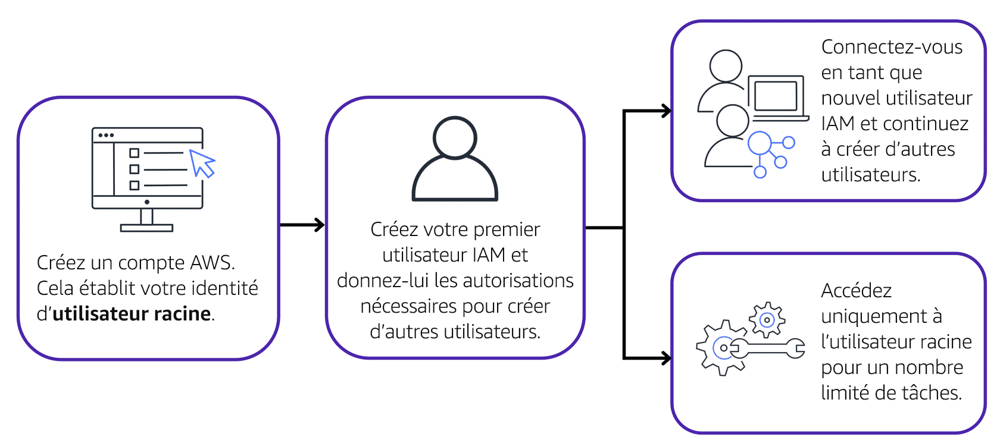

---

## Bonnes pratiques de l'utilisateur racine

- n'utilisez pas l'utilisateur racine pour les tâches quotidiennes.
- tâches spécifique de l'utilisateur racine
  - Modification de l'adresse e-mail de votre utilisateur racine
  - Modification de votre formule AWS Support. 

---

## Utilisateurs IAM

- Un utilisateur IAM est une identité que vous créez dans AWS. Il représente la personne ou l'application qui interagit avec les services et ressources AWS. 
- Par défaut, lorsque vous créez un nouvel utilisateur IAM dans AWS, aucune autorisation ne lui est associée. 
- Bonne pratique : créer des utilisateurs IAM individuels pour chaque personne ayant besoin d'accéder à AWS

---

## Politiques IAM

- Une politique IAM est un document qui autorise ou refuse des autorisations aux services et ressources AWS.  
- Les politiques IAM vous permettent de personnaliser les niveaux d'accès des utilisateurs aux ressources. 
- Par exemple, vous pouvez autoriser les utilisateurs à accéder à tous les compartiments Amazon S3 de votre compte AWS, ou uniquement à un compartiment spécifique.
- Bonne pratique : suivez le principe de sécurité du moindre privilège lors de l'octroi des autorisations.

---

## Exemple de politique IAM

---

## Groupes IAM

- Un groupe IAM est un ensemble d'utilisateurs IAM
- Lorsque vous attribuez une politique IAM à un groupe, tous les utilisateurs du groupe bénéficient des autorisations spécifiées par la politique.
- Évolutivité : Facile d'ajouter ou de retirer des utilisateurs des groupes sans changer les permissions individuellement.
- Organisation : Simplifie la gestion des utilisateurs par rôle ou par fonction.

exemple : Groupe développeurs

---

## Rôles IAM

-  Un rôle IAM est une identité que vous pouvez endosser pour obtenir un accès temporaire aux autorisations.  
-  Permettre aux applications, services et utilisateurs d'assumer des rôles temporaires.
-  Permissions définies par rôle plutôt que par utilisateur individuel.
-  Avant qu'un utilisateur, une application ou un service IAM puisse endosser un rôle IAM, il doit se voir accorder des autorisations pour basculer vers ce rôle
-  Si personne endosse un rôle IAM, cette personne abandonne toutes les autorisations précédentes qu'elle possédait sous un rôle antérieur et endosse les autorisations du nouveau rôle
- Bonne pratique : les rôles IAM conviennent parfaitement lorsque l'accès aux services ou aux ressources doit être accordé temporairement, plutôt qu'à long terme.  

---

## Exemple pratique de rôle

|   |  |  |
|:-------------------------:|:-------------------------:|:---------------------------:|
|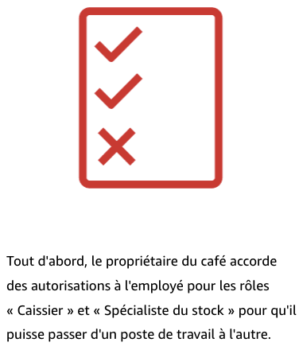<!-- .element height="80%" width="80%" -->  |  <!-- .element height="80%" width="80%" --> | 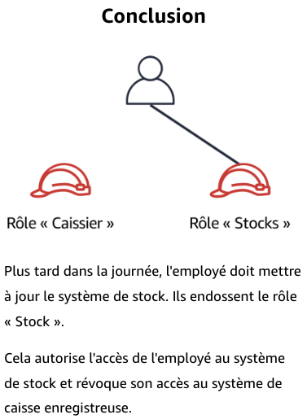<!-- .element height="80%" width="80%" --> |

---

## Authentification multifactorielle

-  l'authentification multifactorielle (MFA, Multi-Factor Authentication) fournit une couche supplémentaire de sécurité pour votre compte AWS

|   |   |
|:-------------------------:|:---------------------------:|
|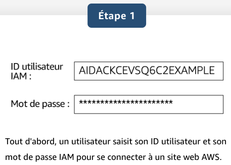<!-- .element height="80%" width="80%" -->  |  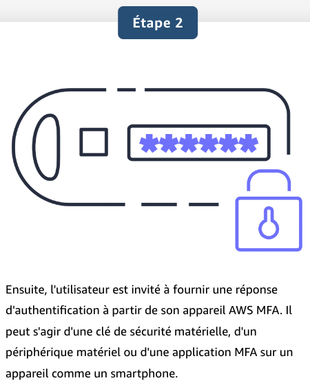<!-- .element height="80%" width="80%" --> |

---

## AWS Organizations

- Consolider et gérer plusieurs comptes AWS au sein d'un emplacement central.
- Lorsque vous créez une organisation, AWS Organizations crée automatiquement une racine, qui est le conteneur parent de tous les comptes de votre organisation.
- Contrôler de manière centralisée les autorisations pour les comptes de votre organisation à l'aide de stratégies de contrôle des services (SCP).
- Les SCP vous permettent d'imposer des restrictions sur les services AWS, les ressources et les actions d'API individuelles auxquelles les utilisateurs et les rôles de chaque compte peuvent accéder.
- Regrouper des comptes en unités d'organisation (UO) pour faciliter la gestion des comptes ayant des exigences commerciales ou de sécurité similaires

---

## AWS Organizations : Exemple

|   |  |  |
|:-------------------------:|:-------------------------:|:---------------------------:|
|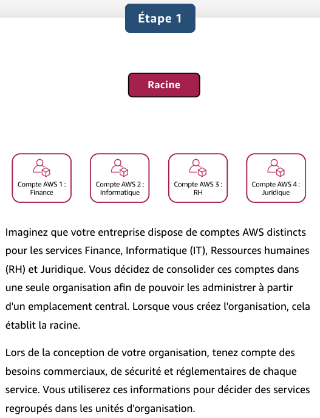<!-- .element height="80%" width="80%" -->  |  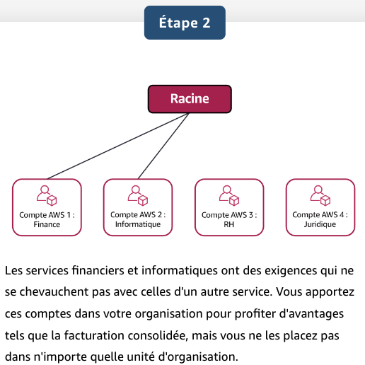<!-- .element height="80%" width="80%" --> | 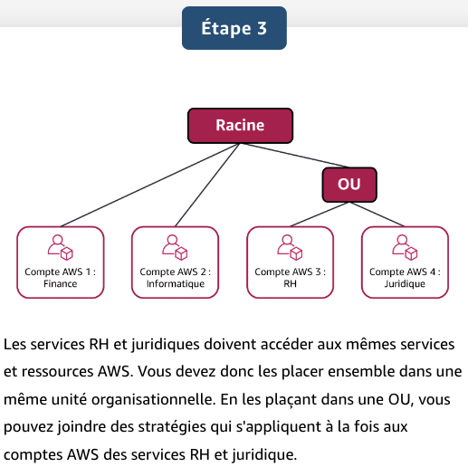<!-- .element height="80%" width="80%" --> |

---

<!-- .slide: data-auto-animate -->
#### Quiz: Vous configurez des stratégies de contrôle des services (SCP) dans AWS Organizations. À quelles identités et ressources les SCP peuvent-elles être appliquées ? (Sélectionnez DEUX propositions.) <!-- .element: style="color:#fd9731;" -->

- Des utilisateurs IAM
- Des groupes IAM
- Un compte de membre individuel
- Des rôles IAM
- Une unité organisationnelle (OU)

---

<!-- .slide: data-auto-animate -->
#### Quiz: Vous configurez des stratégies de contrôle des services (SCP) dans AWS Organizations. À quelles identités et ressources les SCP peuvent-elles être appliquées ? (Sélectionnez DEUX propositions.) <!-- .element: style="color:#fd9731;" -->

- Des utilisateurs IAM
- Des groupes IAM
- Un compte de membre individuel  <!-- .element: style="color:#0de07d;" -->
- Des rôles IAM
- Une unité organisationnelle (OU)  <!-- .element: style="color:#0de07d;" -->

## Conformité (Compliance) avec AWS Artifact

- Selon le secteur d'activité de votre entreprise, vous devrez peut-être respecter des normes spécifiques. Un audit ou une inspection permettra de s'assurer que l'entreprise a respecté ces normes.
- service qui fournit un accès à la demande aux rapports de sécurité et de conformité AWS et à certains contrats en ligne.
    - AWS Artifact Agreements : Signer un accord entre l'entreprise et AWS pour certain type d'information. Exp : HIPAA
    - AWS Artifact Reports : Supposons ensuite qu'un membre de l'équipe de développement de votre entreprise conçoive une application et qu'il ait besoin de plus d'informations sur sa responsabilité de se conformer à certaines normes réglementaires. Vous pouvez lui conseiller d'accéder à ces informations dans AWS Artifact Reports.

---

## conformite

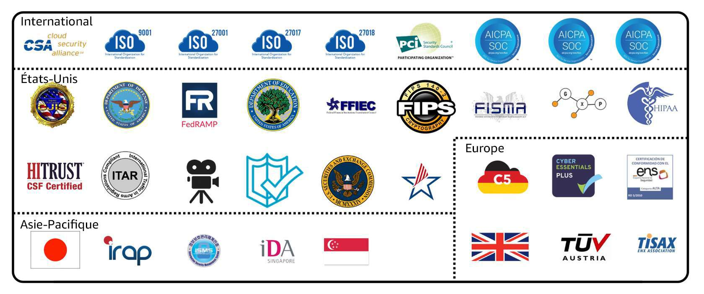

---

## Centre de conformité client

- ressources pour vous aider à en savoir plus sur la conformité AWS. 
- lire des témoignages de clients sur la conformité, 
- découvrir comment les entreprises des secteurs réglementés ont résolu divers défis en matière de conformité, de gouvernance et d'audit
-  accéder aux livres blancs et à la documentation sur la conformité 
   - les réponses AWS aux principales questions de conformité ;
   - Une présentation des risques et de la conformité AWS
   - Une liste de contrôle de la sécurité d'audit.

---

<!-- .slide: data-auto-animate -->
#### Quiz: Quelles tâches pouvez-vous effectuer dans AWS Artifact ? (Sélectionnez DEUX propositions.) <!-- .element: style="color:#fd9731;" -->

- Accéder aux rapports de conformité AWS à la demande.
- Consolider et gérer plusieurs comptes AWS au sein d'un emplacement central.
- Créer des utilisateurs pour permettre aux personnes et aux applications d'interagir avec les services et ressources AWS.
- Définir les autorisations pour les comptes en configurant des stratégies de contrôle des services (SCP).
- Consulter, accepter et gérer des accords avec AWS.

---

<!-- .slide: data-auto-animate -->
#### Quiz: Quelles tâches pouvez-vous effectuer dans AWS Artifact ? (Sélectionnez DEUX propositions.) <!-- .element: style="color:#fd9731;" -->

- Accéder aux rapports de conformité AWS à la demande. <!-- .element: style="color:#0de07d;" -->
- Consolider et gérer plusieurs comptes AWS au sein d'un emplacement central.
- Créer des utilisateurs pour permettre aux personnes et aux applications d'interagir avec les services et ressources AWS.
- Définir les autorisations pour les comptes en configurant des stratégies de contrôle des services (SCP).
- Consulter, accepter et gérer des accords avec AWS. <!-- .element: style="color:#0de07d;" -->
  
---

## Attaques par déni de service (DoS)

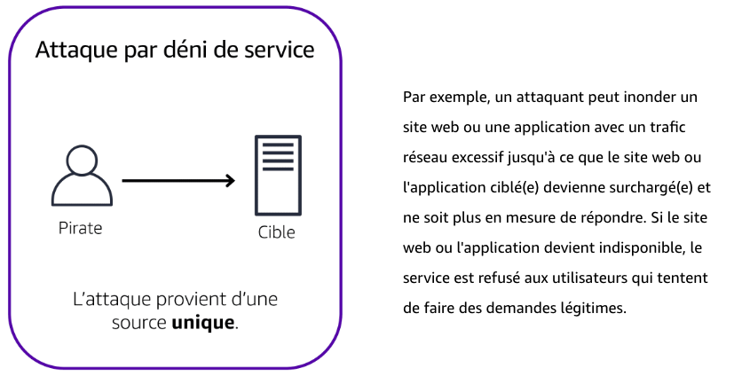

---

## Attaques par déni de service distribué (DDoS)

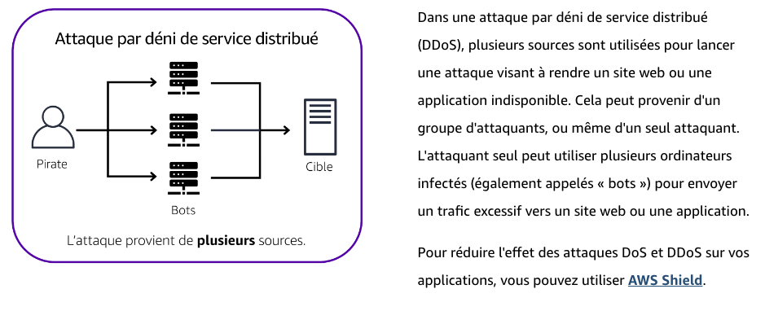

---

## AWS Shield

- service qui protège les applications contre les attaques par déni de service distribué (DDoS)
- AWS Shield Standard protège automatiquement tous les clients AWS, sans aucuns frais. Ce service protège vos ressources AWS contre les attaques les plus communes par déni de service distribué (DDoS), c'est-à-dire celles qui surviennent le plus souvent. 
- AWS Shield Advanced est un service payant qui fournit des diagnostics détaillés des attaques et permet de détecter et d'atténuer les attaques DDoS sophistiquées. 

---

## Services de sécurité supplémentaires

---

## AWS Key Management Service (AWS KMS)

- Fonctionnalités Principales :
   - Effectuer des opérations de chiffrement avec des clés de chiffrement.
   - Créer, gérer et utiliser des clés de chiffrement.
   - Contrôler l'utilisation des clés dans divers services et applications.

- Contrôle d'Accès :
   - Spécifier les utilisateurs et rôles IAM autorisés à gérer les clés.
   - Désactiver temporairement les clés pour empêcher leur utilisation.

- Sécurité :
   - Les clés ne quittent jamais AWS KMS, garantissant un contrôle total.

---

## AWS WAF

- Fonctionnalités Principales :
   - pare-feu d'application web contre les menaces courantes.
   - Filtrage du trafic web en définissant des règles de sécurité.
   - Gestion des attaques telles que les injections SQL et les scripts intersites (XSS).

- Contrôle de Sécurité :
   - Créez des règles personnalisées pour bloquer les modèles de trafic malveillant.
   - Utilisez des groupes de règles préconfigurées pour une protection rapide.
   - Surveillez les demandes et ajustez les règles en temps réel.

- Intégration :
   - Fonctionne avec Amazon CloudFront, Application Load Balancer (ALB), API Gateway.
   - S'intègre facilement avec d'autres services AWS pour une sécurité renforcée.

---

## AWS Inspector

- Fonctionnalités Principales :
   - Exécute des évaluations de sécurité automatisées.
   - Détecte les failles de sécurité et les écarts par rapport aux bonnes pratiques.
   - Vérifie les accès libres aux instances EC2 et les versions de logiciels vulnérables.

- Résultats et Priorisation :
   - Fournit une liste des résultats de sécurité classés par niveau de gravité.
   - Offre des descriptions détaillées de chaque problème de sécurité.
   - Propose des recommandations pour résoudre les problèmes identifiés.

- Responsabilité Partagée :
   - AWS fournit des recommandations, mais ne garantit pas la résolution de tous les problèmes.
   - Les clients sont responsables de la sécurité de leurs applications, processus et outils sur AWS.

---

## Amazon GuardDuty

-  service qui fournit une détection intelligente des menaces pour votre infrastructure et vos ressources AWS
-  détecte les menaces grâce à une surveillance en continu des activités de réseau et des comportements de compte au sein de votre environnement AWS

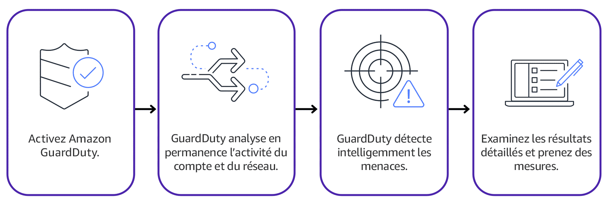<!-- .element height="80%" width="80%" -->

---

## Inspector vs GuardDuty

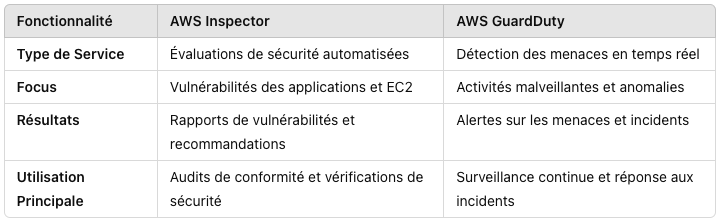<!-- .element height="80%" width="80%" -->

---

<!-- .slide: data-auto-animate -->
#### Quiz: Quelle affirmation décrit le mieux une politique IAM ? <!-- .element: style="color:#fd9731;" -->

- Un processus d'authentification qui fournit une couche supplémentaire de protection pour votre compte AWS
- Un document qui accorde ou refuse des autorisations aux services et ressources AWS 
- Une identité que vous pouvez endosser pour obtenir un accès temporaire aux autorisations
- Une identité établie lorsque vous créez un compte AWS pour la première fois

---

<!-- .slide: data-auto-animate -->
#### Quiz: Quelle affirmation décrit le mieux une politique IAM ? <!-- .element: style="color:#fd9731;" -->

- Un processus d'authentification qui fournit une couche supplémentaire de protection pour votre compte AWS
- Un document qui accorde ou refuse des autorisations aux services et ressources AWS <!-- .element: style="color:#0de07d;" -->
- Une identité que vous pouvez endosser pour obtenir un accès temporaire aux autorisations
- Une identité établie lorsque vous créez un compte AWS pour la première fois

---

<!-- .slide: data-auto-animate -->
#### Quiz: Un employé a besoin d'un accès temporaire pour créer plusieurs compartiments Amazon S3. Quelle option serait le meilleur choix pour cette tâche ? <!-- .element: style="color:#fd9731;" -->

- Utilisateur racine d'un compte AWS
- Groupe IAM
- Rôle IAM
- Stratégies de contrôle des services (SCP)

---

<!-- .slide: data-auto-animate -->
#### Quiz: Un employé a besoin d'un accès temporaire pour créer plusieurs compartiments Amazon S3. Quelle option serait le meilleur choix pour cette tâche ? <!-- .element: style="color:#fd9731;" -->

- Utilisateur racine d'un compte AWS
- Groupe IAM
- Rôle IAM <!-- .element: style="color:#0de07d;" -->
- Stratégies de contrôle des services (SCP)

---

<!-- .slide: data-auto-animate -->
#### Quiz: Quelle affirmation décrit le mieux le principe du moindre privilège ? <!-- .element: style="color:#fd9731;" -->

- Ajouter un utilisateur IAM dans au moins un groupe IAM
- Vérifier les autorisations d'un paquet par rapport à une liste de contrôle d'accès
- Octroyer uniquement les autorisations nécessaires à l'exécution de tâches spécifiques
- Exécuter une attaque par déni de service provenant d'au moins un périphérique

---

<!-- .slide: data-auto-animate -->
#### Quiz: Quelle affirmation décrit le mieux le principe du moindre privilège ? <!-- .element: style="color:#fd9731;" -->

- Ajouter un utilisateur IAM dans au moins un groupe IAM
- Vérifier les autorisations d'un paquet par rapport à une liste de contrôle d'accès
- Octroyer uniquement les autorisations nécessaires à l'exécution de tâches spécifiques <!-- .element: style="color:#0de07d;" -->
- Exécuter une attaque par déni de service provenant d'au moins un périphérique

---

<!-- .slide: data-auto-animate -->
#### Quiz: Quel service aide à protéger vos applications contre les attaques par déni de service distribué (DDoS) ? <!-- .element: style="color:#fd9731;" -->

- Amazon GuardDuty
- Amazon Inspector
- AWS Artifact
- AWS Shield

---

<!-- .slide: data-auto-animate -->
#### Quiz: Quel service aide à protéger vos applications contre les attaques par déni de service distribué (DDoS) ? <!-- .element: style="color:#fd9731;" -->

- Amazon GuardDuty
- Amazon Inspector
- AWS Artifact
- AWS Shield <!-- .element: style="color:#0de07d;" -->

---

<!-- .slide: data-auto-animate -->
#### Quiz: Quelle tâche AWS Key Management Service (AWS KMS) peut-il effectuer ? <!-- .element: style="color:#fd9731;" -->

- Configurer l'authenfication multifactorielle (MFA).
- Mettre à jour le mot de passe de l'utilisateur racine du compte AWS.
- Créer des clés de chiffrement.
- Attribuer des autorisations aux utilisateurs et aux groupes.

---

<!-- .slide: data-auto-animate -->
#### Quiz: Quelle tâche AWS Key Management Service (AWS KMS) peut-il effectuer ? <!-- .element: style="color:#fd9731;" -->

- Configurer l'authenfication multifactorielle (MFA).
- Mettre à jour le mot de passe de l'utilisateur racine du compte AWS.
- Créer des clés de chiffrement. <!-- .element: style="color:#0de07d;" -->
- Attribuer des autorisations aux utilisateurs et aux groupes.