## Introduction du module 6 et objectifs

- Approches de contrôle de votre environnement AWS.
- Avantages d'Amazon CloudWatch.
- Avantages d'AWS CloudTrail.
- Avantages d'AWS Trusted Advisor.
---

## Amazon CloudWatch

Service de surveillance et de gestion des ressources AWS et des applications exécutées sur AWS.

- Surveillance des Ressources :
   - Collecte et suit les métriques des services AWS et des applications.
   - Surveille les instances EC2, les bases de données RDS, les fonctions Lambda, etc.
- Journalisation :
   - Collecte, surveille et analyse les logs d'application et de système.
   - Intègre les logs de divers services AWS pour une visibilité centralisée.
- Alertes et Notifications :
   - Configurez des alarmes pour recevoir des notifications en cas de dépassement de seuils prédéfinis.
   - Utilise Amazon SNS pour envoyer des alertes via email, SMS, ou appels d'API.
  
---

## Amazon CloudWatch : Tableau de bord

<!-- .element height="80%" width="80%" -->

---

## AWS CloudTrail

Service qui permet la gouvernance, la conformité, l'audit opérationnel et la gestion des risques de votre compte AWS.

- Enregistrement des Activités :
   - Enregistre les appels d'API AWS, les actions de la console, et les événements AWS SDK.
   - Capture les informations sur l'utilisateur, l'heure, l'IP source, et les détails des demandes.
- Surveillance Continue :
   - Fournit une visibilité continue sur les activités des utilisateurs et des ressources AWS.
   - Génère des journaux d'événements détaillés et les envoie à Amazon S3.
- Intégration avec CloudWatch :
   - Envoie les événements CloudTrail à Amazon CloudWatch Logs pour la surveillance en temps réel et les alertes.

---

## Exemple : événement Cloud Trail

<!-- .element height="80%" width="80%" -->

---

## CloudTrail Insights

- Dans CloudTrail, vous pouvez également activer CloudTrail Insights. Cette fonction facultative permet à CloudTrail de détecter automatiquement les activités d'API inhabituelles sur votre compte AWS. 

- Par exemple, CloudTrail Insights peut détecter si un nombre plus élevé d'instances Amazon EC2 que d'habitude a récemment été lancé dans votre compte. Vous pouvez ensuite consulter tous les détails de l'événement pour déterminer les actions que vous devez effectuer ensuite.

## AWS Trusted Advisor

- service web qui inspecte votre environnement AWS et fournit des recommandations en temps réel, conformément aux bonnes pratiques AWS.
- compare ses résultats aux bonnes pratiques AWS selon cinq catégories : 
   - l'optimisation des coûts, 
   - les performances, 
   - la sécurité, 
   - la tolérance aux pannes,
   - les limites de service.

---

## Tableau de bord : trustadvisor

<!-- .element height="80%" width="80%" -->

- La coche verte indique le nombre d'éléments pour lesquels aucun problème n'a été détecté.
- Le triangle orange représente le nombre d'avertissements/recommandations
- Le cercle rouge représente les problèmes critiques/actions recommandées.
  
---

## Modèle de responsabilité partagée

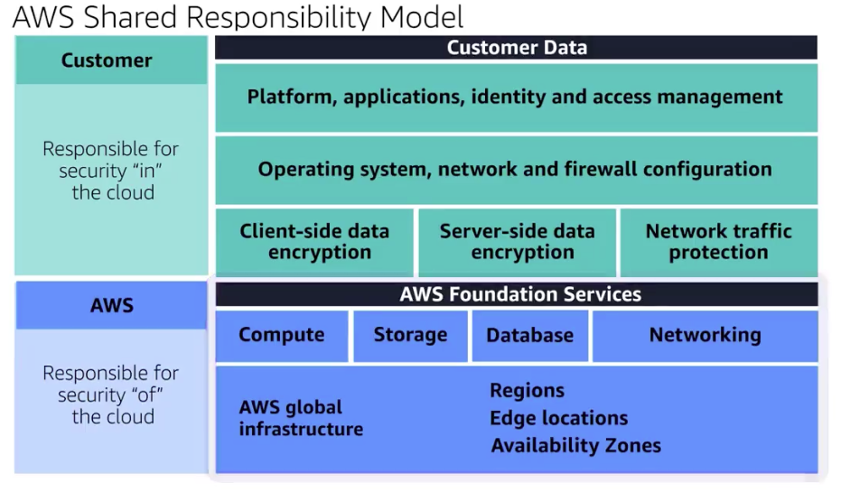

---

## Exemple avec EC2

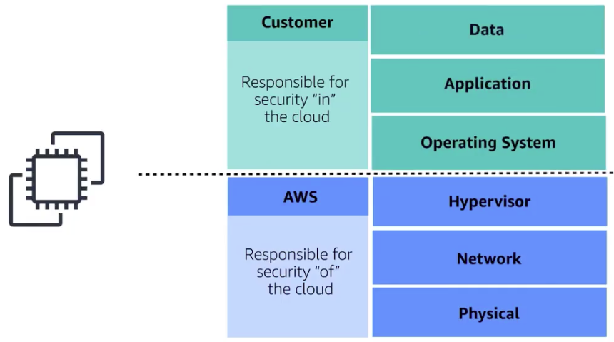

---

## Responsabilité partagée

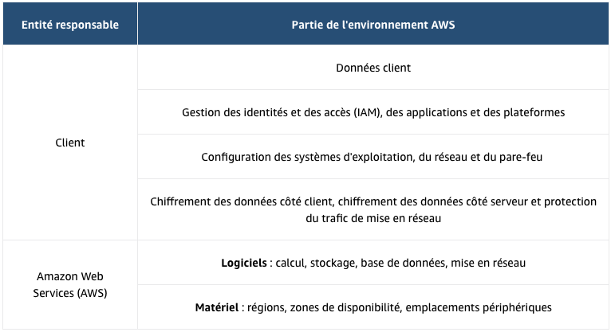

---

## Autorisations et accès utilisateur

---

## Gestion des identités et des accès AWS (AWS IAM)

AWS IAM : AWS Identity and Access Management
- Permet de gérer, de façon sécurisée, l'accès aux services et ressources AWS.   
- Offre la flexibilité nécessaire pour configurer l'accès en fonction des besoins opérationnels et de sécurité spécifiques de votre entreprise. 
  - Utilisateurs, groupes et rôles IAM
  - Stratégies IAM
  - Authentification multifactorielle

---

## Utilisateur racine d'un compte AWS

- Utilisateur principal
- Accès complet à tous les services et ressources AWS du compte

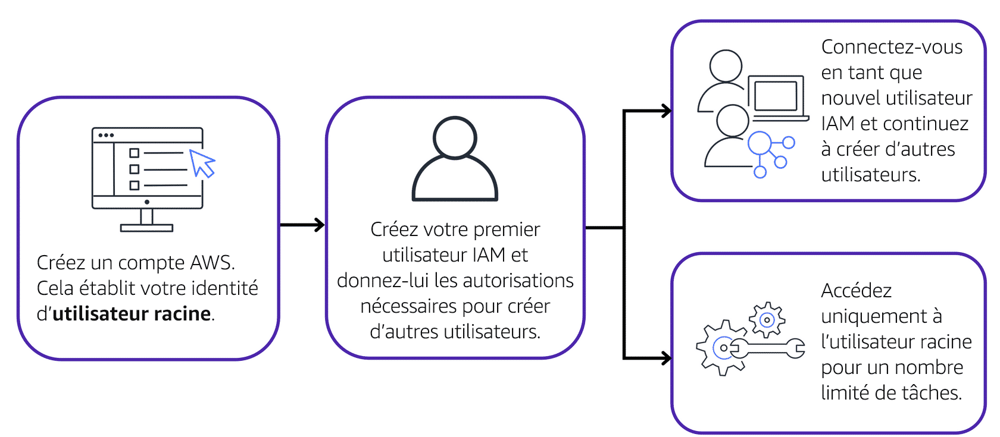

---

## Bonnes pratiques de l'utilisateur racine

- n'utilisez pas l'utilisateur racine pour les tâches quotidiennes.
- tâches spécifique de l'utilisateur racine
  - Modification de l'adresse e-mail de votre utilisateur racine
  - Modification de votre formule AWS Support. 

---

## Utilisateurs IAM

- Un utilisateur IAM est une identité que vous créez dans AWS. Il représente la personne ou l'application qui interagit avec les services et ressources AWS. 
- Par défaut, lorsque vous créez un nouvel utilisateur IAM dans AWS, aucune autorisation ne lui est associée. 
- Bonne pratique : créer des utilisateurs IAM individuels pour chaque personne ayant besoin d'accéder à AWS

---

## Politiques IAM

- Une politique IAM est un document qui autorise ou refuse des autorisations aux services et ressources AWS.  
- Les politiques IAM vous permettent de personnaliser les niveaux d'accès des utilisateurs aux ressources. 
- Par exemple, vous pouvez autoriser les utilisateurs à accéder à tous les compartiments Amazon S3 de votre compte AWS, ou uniquement à un compartiment spécifique.
- Bonne pratique : suivez le principe de sécurité du moindre privilège lors de l'octroi des autorisations.

---

## Exemple de politique IAM

---

## Groupes IAM

- Un groupe IAM est un ensemble d'utilisateurs IAM
- Lorsque vous attribuez une politique IAM à un groupe, tous les utilisateurs du groupe bénéficient des autorisations spécifiées par la politique.
- Évolutivité : Facile d'ajouter ou de retirer des utilisateurs des groupes sans changer les permissions individuellement.
- Organisation : Simplifie la gestion des utilisateurs par rôle ou par fonction.

exemple : Groupe développeurs

---

## Rôles IAM

-  Un rôle IAM est une identité que vous pouvez endosser pour obtenir un accès temporaire aux autorisations.  
-  Permettre aux applications, services et utilisateurs d'assumer des rôles temporaires.
-  Permissions définies par rôle plutôt que par utilisateur individuel.
-  Avant qu'un utilisateur, une application ou un service IAM puisse endosser un rôle IAM, il doit se voir accorder des autorisations pour basculer vers ce rôle
-  Si personne endosse un rôle IAM, cette personne abandonne toutes les autorisations précédentes qu'elle possédait sous un rôle antérieur et endosse les autorisations du nouveau rôle
- Bonne pratique : les rôles IAM conviennent parfaitement lorsque l'accès aux services ou aux ressources doit être accordé temporairement, plutôt qu'à long terme.  

---

## Exemple pratique de rôle

|   |  |  |
|:-------------------------:|:-------------------------:|:---------------------------:|
|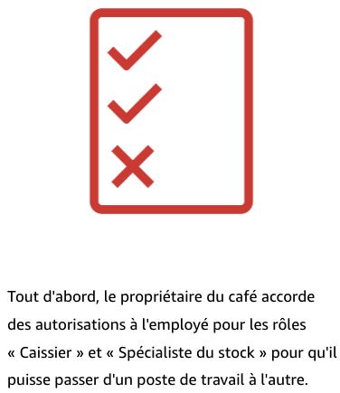<!-- .element height="80%" width="80%" -->  |  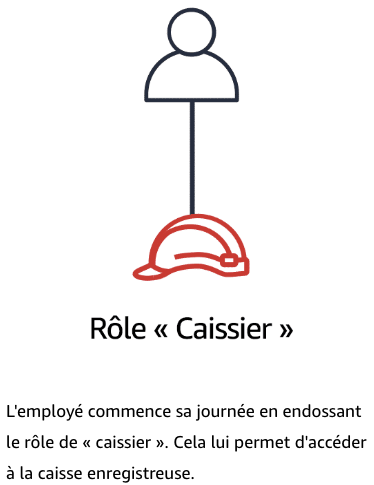<!-- .element height="80%" width="80%" --> | 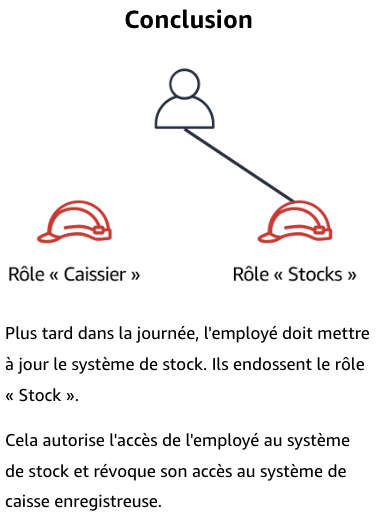<!-- .element height="80%" width="80%" --> |

---

## Authentification multifactorielle

-  l'authentification multifactorielle (MFA, Multi-Factor Authentication) fournit une couche supplémentaire de sécurité pour votre compte AWS

|   |   |
|:-------------------------:|:---------------------------:|
|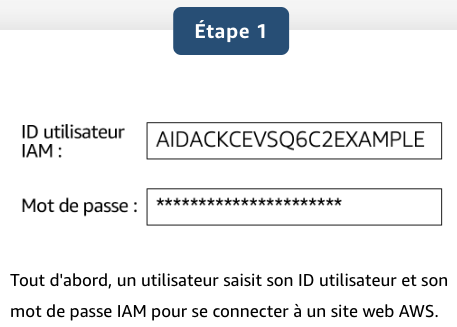<!-- .element height="80%" width="80%" -->  |  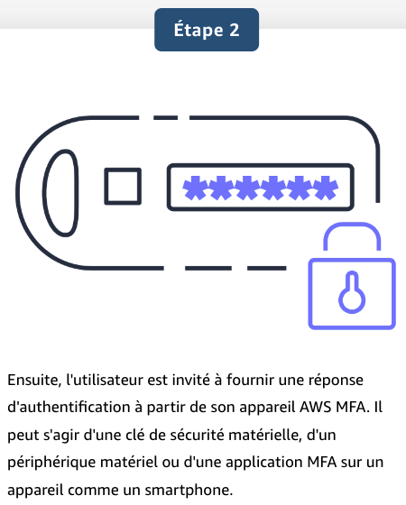<!-- .element height="80%" width="80%" --> |

---

## AWS Organizations

- Consolider et gérer plusieurs comptes AWS au sein d'un emplacement central.
- Lorsque vous créez une organisation, AWS Organizations crée automatiquement une racine, qui est le conteneur parent de tous les comptes de votre organisation.
- Contrôler de manière centralisée les autorisations pour les comptes de votre organisation à l'aide de stratégies de contrôle des services (SCP).
- Les SCP vous permettent d'imposer des restrictions sur les services AWS, les ressources et les actions d'API individuelles auxquelles les utilisateurs et les rôles de chaque compte peuvent accéder.
- Regrouper des comptes en unités d'organisation (UO) pour faciliter la gestion des comptes ayant des exigences commerciales ou de sécurité similaires

---

## AWS Organizations : Exemple

|   |  |  |
|:-------------------------:|:-------------------------:|:---------------------------:|
|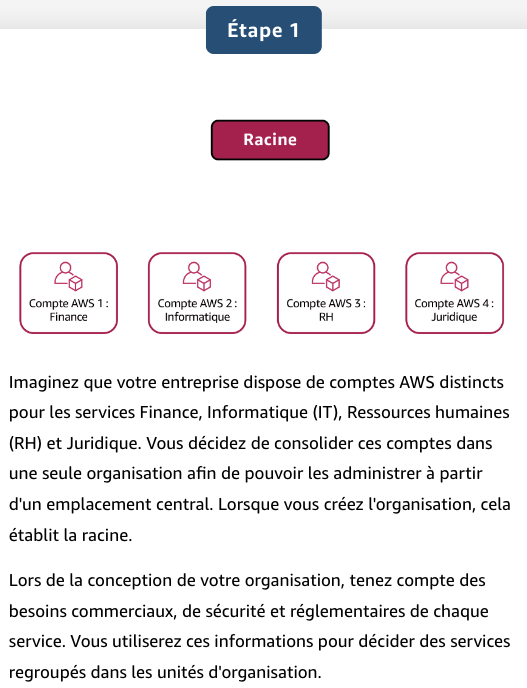<!-- .element height="80%" width="80%" -->  |  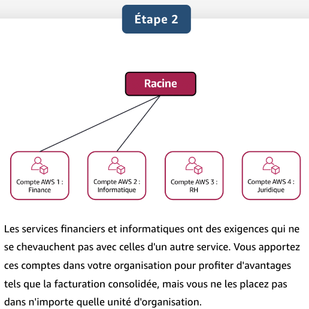<!-- .element height="80%" width="80%" --> | 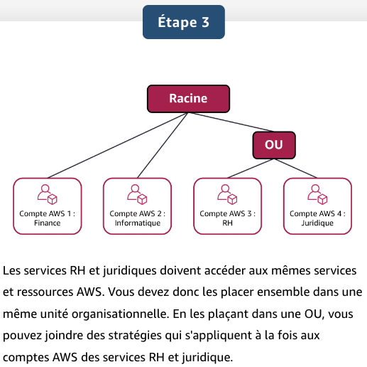<!-- .element height="80%" width="80%" --> |

---

## Conformité (Compliance) avec AWS Artifact

- Selon le secteur d'activité de votre entreprise, vous devrez peut-être respecter des normes spécifiques. Un audit ou une inspection permettra de s'assurer que l'entreprise a respecté ces normes.
- service qui fournit un accès à la demande aux rapports de sécurité et de conformité AWS et à certains contrats en ligne.
    - AWS Artifact Agreements : Signer un accord entre l'entreprise et AWS pour certain type d'information. Exp : HIPAA
    - AWS Artifact Reports : Supposons ensuite qu'un membre de l'équipe de développement de votre entreprise conçoive une application et qu'il ait besoin de plus d'informations sur sa responsabilité de se conformer à certaines normes réglementaires. Vous pouvez lui conseiller d'accéder à ces informations dans AWS Artifact Reports.

---

## conformite

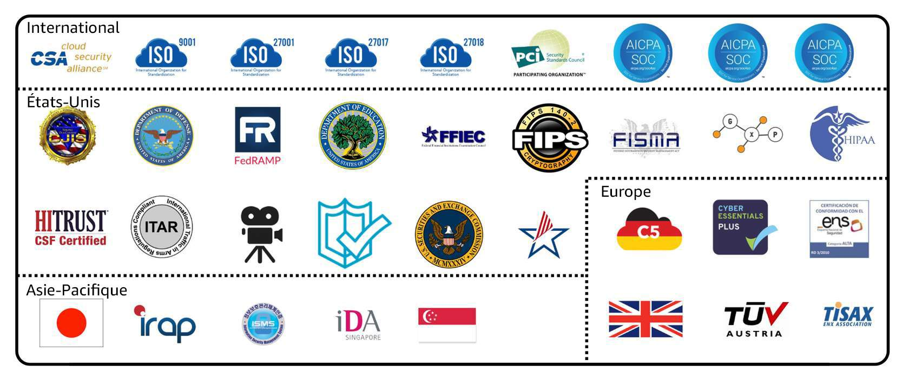

---

## Centre de conformité client

- ressources pour vous aider à en savoir plus sur la conformité AWS. 
- lire des témoignages de clients sur la conformité, 
- découvrir comment les entreprises des secteurs réglementés ont résolu divers défis en matière de conformité, de gouvernance et d'audit
-  accéder aux livres blancs et à la documentation sur la conformité 
   - les réponses AWS aux principales questions de conformité ;
   - Une présentation des risques et de la conformité AWS
   - Une liste de contrôle de la sécurité d'audit.

---

## Attaques par déni de service (DoS)

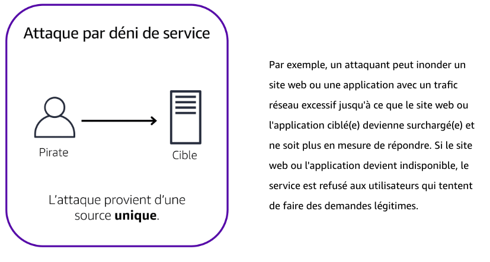

---

## Attaques par déni de service distribué (DDoS)

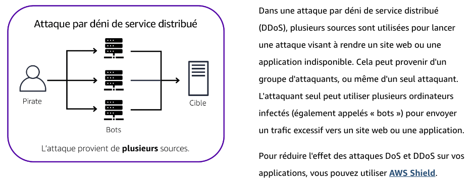

---

## AWS Shield

- service qui protège les applications contre les attaques par déni de service distribué (DDoS)
- AWS Shield Standard protège automatiquement tous les clients AWS, sans aucuns frais. Ce service protège vos ressources AWS contre les attaques les plus communes par déni de service distribué (DDoS), c'est-à-dire celles qui surviennent le plus souvent. 
- AWS Shield Advanced est un service payant qui fournit des diagnostics détaillés des attaques et permet de détecter et d'atténuer les attaques DDoS sophistiquées. 

---

## Services de sécurité supplémentaires

---

## AWS Key Management Service (AWS KMS)

- Fonctionnalités Principales :
   - Effectuer des opérations de chiffrement avec des clés de chiffrement.
   - Créer, gérer et utiliser des clés de chiffrement.
   - Contrôler l'utilisation des clés dans divers services et applications.

- Contrôle d'Accès :
   - Spécifier les utilisateurs et rôles IAM autorisés à gérer les clés.
   - Désactiver temporairement les clés pour empêcher leur utilisation.

- Sécurité :
   - Les clés ne quittent jamais AWS KMS, garantissant un contrôle total.

---

## AWS WAF

- Fonctionnalités Principales :
   - pare-feu d'application web contre les menaces courantes.
   - Filtrage du trafic web en définissant des règles de sécurité.
   - Gestion des attaques telles que les injections SQL et les scripts intersites (XSS).

- Contrôle de Sécurité :
   - Créez des règles personnalisées pour bloquer les modèles de trafic malveillant.
   - Utilisez des groupes de règles préconfigurées pour une protection rapide.
   - Surveillez les demandes et ajustez les règles en temps réel.

- Intégration :
   - Fonctionne avec Amazon CloudFront, Application Load Balancer (ALB), API Gateway.
   - S'intègre facilement avec d'autres services AWS pour une sécurité renforcée.

---

## AWS Inspector

- Fonctionnalités Principales :
   - Exécute des évaluations de sécurité automatisées.
   - Détecte les failles de sécurité et les écarts par rapport aux bonnes pratiques.
   - Vérifie les accès libres aux instances EC2 et les versions de logiciels vulnérables.

- Résultats et Priorisation :
   - Fournit une liste des résultats de sécurité classés par niveau de gravité.
   - Offre des descriptions détaillées de chaque problème de sécurité.
   - Propose des recommandations pour résoudre les problèmes identifiés.

- Responsabilité Partagée :
   - AWS fournit des recommandations, mais ne garantit pas la résolution de tous les problèmes.
   - Les clients sont responsables de la sécurité de leurs applications, processus et outils sur AWS.

---

## Amazon GuardDuty

-  service qui fournit une détection intelligente des menaces pour votre infrastructure et vos ressources AWS
-  détecte les menaces grâce à une surveillance en continu des activités de réseau et des comportements de compte au sein de votre environnement AWS

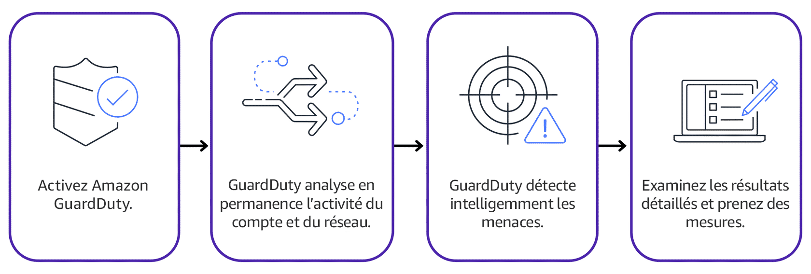<!-- .element height="80%" width="80%" -->

---

## Inspector vs GuardDuty

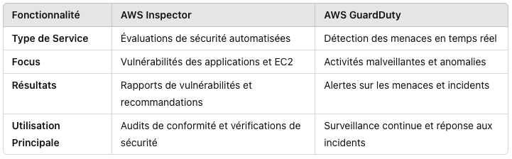<!-- .element height="80%" width="80%" -->