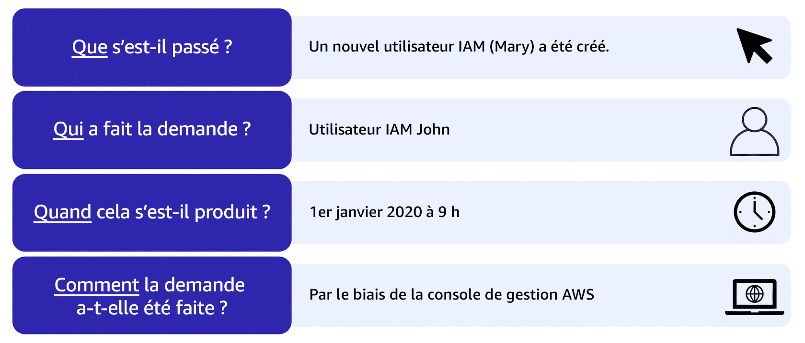
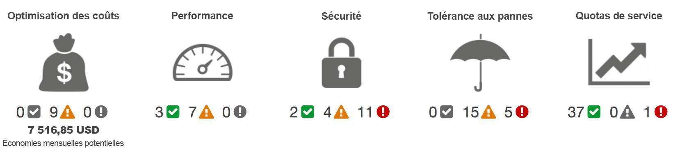

## Introduction du module 7 et objectifs

- Avantages d'Amazon CloudWatch.
- Avantages d'AWS CloudTrail.
- Avantages d'AWS Trusted Advisor.
---

## Amazon CloudWatch

Service de surveillance et de gestion des ressources AWS et des applications exécutées sur AWS.

- Surveillance des Ressources :
   - Collecte et suit les métriques des services AWS et des applications.
   - Surveille les instances EC2, les bases de données RDS, les fonctions Lambda, etc.
- Journalisation :
   - Collecte, surveille et analyse les logs d'application et de système.
   - Intègre les logs de divers services AWS pour une visibilité centralisée.
- Alertes et Notifications :
   - Configurez des alarmes pour recevoir des notifications en cas de dépassement de seuils prédéfinis.
   - Utilise Amazon SNS pour envoyer des alertes via email, SMS, ou appels d'API.
  
---

## Amazon CloudWatch : Tableau de bord

<!-- .element height="80%" width="80%" -->

---

## AWS CloudTrail

Service qui permet la gouvernance, la conformité, l'audit opérationnel et la gestion des risques de votre compte AWS.

- Enregistrement des Activités :
   - Enregistre les appels d'API AWS, les actions de la console, et les événements AWS SDK.
   - Capture les informations sur l'utilisateur, l'heure, l'IP source, et les détails des demandes.
- Surveillance Continue :
   - Fournit une visibilité continue sur les activités des utilisateurs et des ressources AWS.
   - Génère des journaux d'événements détaillés et les envoie à Amazon S3.
- Intégration avec CloudWatch :
   - Envoie les événements CloudTrail à Amazon CloudWatch Logs pour la surveillance en temps réel et les alertes.

---

## Exemple : événement Cloud Trail

<!-- .element height="80%" width="80%" -->

---

## CloudTrail Insights

- Dans CloudTrail, vous pouvez également activer CloudTrail Insights. Cette fonction facultative permet à CloudTrail de détecter automatiquement les activités d'API inhabituelles sur votre compte AWS. 

- Par exemple, CloudTrail Insights peut détecter si un nombre plus élevé d'instances Amazon EC2 que d'habitude a récemment été lancé dans votre compte. Vous pouvez ensuite consulter tous les détails de l'événement pour déterminer les actions que vous devez effectuer ensuite.

## AWS Trusted Advisor

- service web qui inspecte votre environnement AWS et fournit des recommandations en temps réel, conformément aux bonnes pratiques AWS.
- compare ses résultats aux bonnes pratiques AWS selon cinq catégories : 
   - l'optimisation des coûts, 
   - les performances, 
   - la sécurité, 
   - la tolérance aux pannes,
   - les limites de service.

---

## Tableau de bord : trustadvisor

<!-- .element height="80%" width="80%" -->

- La coche verte indique le nombre d'éléments pour lesquels aucun problème n'a été détecté.
- Le triangle orange représente le nombre d'avertissements/recommandations
- Le cercle rouge représente les problèmes critiques/actions recommandées.