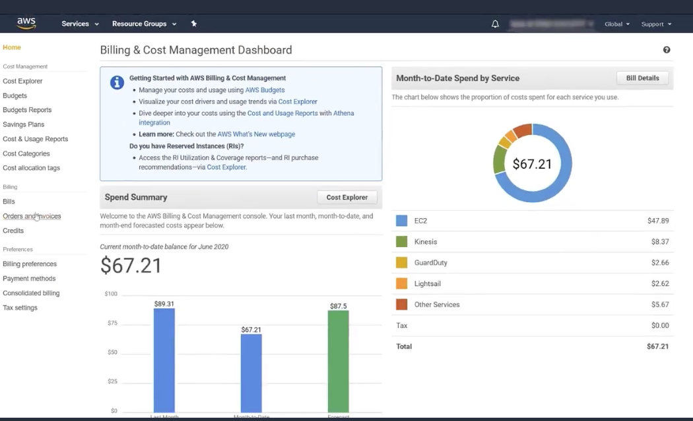
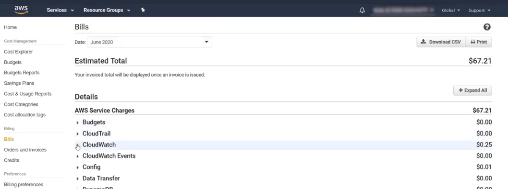
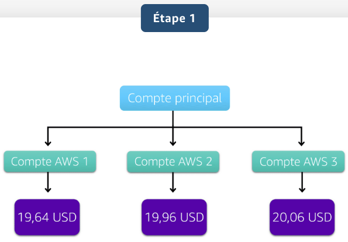
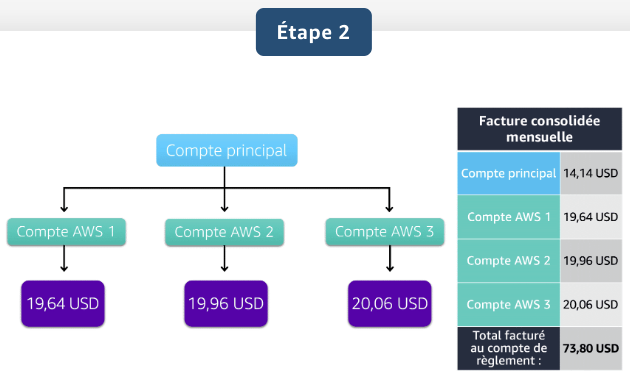
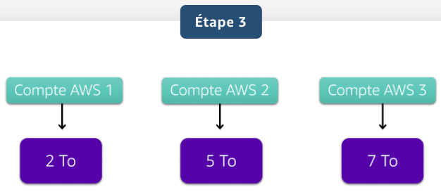
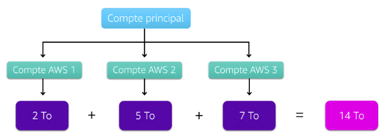
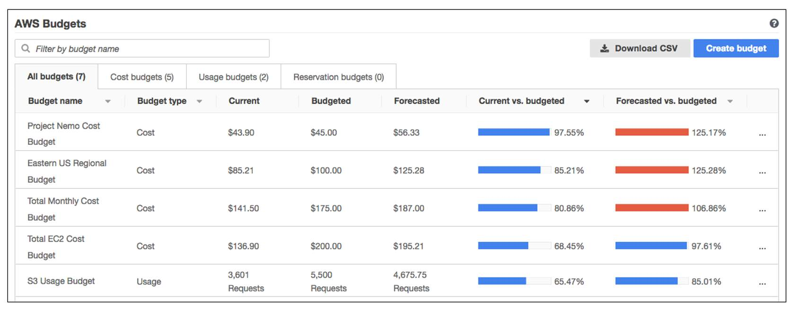
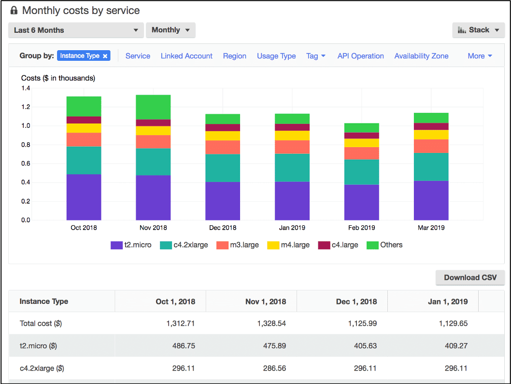
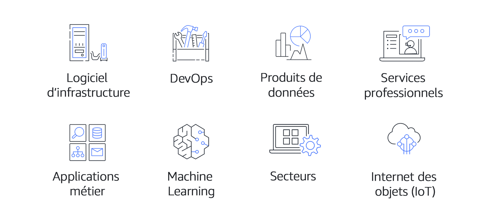

## Introduction du module 8 et objectifs

- Offre gratuite d'AWS ;
- Principaux avantages d'AWS Organizations et de la facturation consolidée ;
- Avantages d'AWS Budget ;
- Avantages d'AWS Cost Explorer ;
- Avantages du Calculateur de prix AWS ;
- Distinction entre les diverses formules AWS Support ;
- Avantages d'AWS Marketplace.

---

## AWS Free Tier

L'offre gratuite d'AWS vous permet de commencer à utiliser certains services sans vous soucier des coûts pour la période spécifiée. 

- Toujours gratuites : Ces offres n'expirent pas et sont disponibles pour tous les clients AWS.
   - Par exemple, AWS Lambda assure 1 million de requêtes gratuites et jusqu'à 3,2 millions de secondes de temps de calcul par mois. 
   - Amazon DynamoDB offre 25 Go de stockage gratuit par mois.
- 12 mois gratuits : Ces offres sont gratuites pendant 12 mois à compter de la date à laquelle vous vous êtes inscrit à AWS.
   - Les exemples incluent des quantités spécifiques de stockage standard Amazon S3, 
   - des seuils pour les heures de temps de calcul Amazon EC2 par mois 
   - des quantités de transfert de données Amazon CloudFront en sortie.
- Essais : Les offres d'essai gratuit à court terme débutent à la date d'activation d'un service particulier.
   - Par exemple, Amazon Inspector propose un essai gratuit de 90 jours. 
   - Amazon Lightsail (un service qui vous permet d'exécuter des serveurs privés virtuels) offre 750 heures d'utilisation gratuites sur une période de 30 jours.

---

## Fonctionnement de la tarification AWS

- Paiement à l'utilisation
   - Pour chaque service, vous payez la quantité de ressources que vous utilisez réellement, sans contrats à long terme ou licences complexes.    
- Des remises en cas de réservation
   - Certains services offrent des options de réservation qui assurent une remise importante par rapport à la tarification des instances à la demande. 
   - Expemple pour EC2
- Des remises basées sur le volume en cas d'utilisation importante
   - Certains services offrent une tarification progressive, de sorte que le coût unitaire diminue de manière incrémentielle avec une utilisation accrue. 
   - Par exemple, plus vous utilisez d'espace de stockage Amazon S3, moins vous payez par Go  

---

## Calculateur de prix AWS

Vous permet d'explorer les services AWS et de créer une estimation du coût de vos cas d'utilisation sur AWS.

Voir : https://calculator.aws/#/

---

## Exemples de tarification AWS

---

## AWS Lambda

- Pour AWS Lambda, vous payez selon le nombre de requêtes pour vos fonctions et selon le temps nécessaire à leur exécution.
- AWS Lambda garantit 1 million de requêtes gratuites et jusqu'à 3,2 millions de secondes de temps de calcul par mois.
- Vous pouvez faire des économies sur AWS Lambda en vous inscrivant à un Compute Savings Plan. Un Compute Savings Plan assure des coûts de calcul moindres en échange d'un engagement à utiliser un volume constant sur une période d'un an ou de trois ans. C'est un exemple de remise en cas de réservation. 

---

## Amazon EC2

- Avec Amazon EC2, vous payez uniquement le temps de calcul que vous utilisez pendant l'exécution de vos instances.
- Vous pouvez réaliser des économies supplémentaires sur Amazon EC2 en envisageant d'utiliser les Savings Plans et les instances réservées.

---

## Amazon S3

Pour la tarification Amazon S3, tenez compte des composants de coûts suivants :

- Stockage
- Requêtes et extractions de données
- Transfert de données gratuit :
   - Entre compartiments S3 dans la même région AWS.
   - Depuis S3 vers d'autres services AWS dans la même région.
   - Vers S3 à partir d'Internet.
   - Vers Amazon CloudFront.
   - Vers une instance Amazon EC2 dans la même région AWS que le compartiment S3.
- Gestion et réplication : Inventaire Amazon S3, l'analytique et le balisage d'objets.
  
---

## Tableau de bord de facturation

<!-- .element height="80%" width="80%" -->

---

## Tableau de bord de facturation

<!-- .element height="80%" width="80%" -->

---

## Facturation consolidée

- Fonctionnalité d'AWS Organizations
- permet de recevoir une facture unique pour tous les comptes AWS de votre organisation
- suivre les coûts combinés de tous les comptes liés de votre organisation.
-  possibilité de partager la tarification avec remises en bloc, les Savings Plans et les instances réservées entre les comptes de votre organisation.

---

## Exemple

Entreprise avec 3 comptes AWS avec 3 factures différentes

<!-- .element height="80%" width="80%" -->

---

- Créer une organisation et ajouter les 3 comptes
   - coûts du compte principal
   - coûts des 3 comptes
   - facture unique de 73,80 USD 

<!-- .element height="80%" width="80%" -->

---

Dans cet exemple, trois comptes AWS distincts ont transféré différentes quantités de données dans Amazon S3 au cours du mois en cours : 

<!-- .element height="80%" width="80%" -->

Étant donné qu'aucun compte n'a dépassé le seuil de 10 To, aucun d'entre eux n'est éligible au prix de transfert par Go moindre pour les 40 prochains To de données transférées.

---

<!-- .element height="80%" width="80%" -->

- Avec la facture consolidée : dépassement du seuil de transfert de données S3 (14To)
- AWS alloue ensuite à chaque compte lié une partie de la remise sur volume globale en fonction de l'utilisation du compte. 

---

## AWS Budgets

- créer des budgets pour planifier l'utilisation de vos services, les coûts des services et les réservations d'instances
- Les informations dans AWS Budgets sont mises à jour trois fois par jour.
- définir des alertes personnalisées lorsque votre utilisation dépasse (ou va dépasser) le montant prévu au budget

---

## Exeemple AWS Budget

Supposons que vous ayez défini un budget pour Amazon EC2. Vous souhaitez vous assurer que l'utilisation d'Amazon EC2 par votre entreprise ne dépasse pas 200 USD pour le mois. 

<!-- .element height="80%" width="80%" -->

---

## AWS Cost Explorer

- outil qui vous permet de visualiser, de comprendre et de gérer vos coûts et votre utilisation AWS au fil du temps
- inclut un rapport par défaut sur les coûts et l'utilisation de vos cinq services AWS les plus générateurs de coûts. 

---

<!-- .element height="80%" width="80%" -->

---

## Formules AWS Support

- Basic
- Developer
- Business
- Enterprise On-Ramp
- Enterprise

---

## Support Basic

- gratuit pour tous les clients AWS
- accès aux livres blancs, à la documentation et aux communautés de support
- vous pouvez également contacter AWS pour des questions de facturation et d'augmentations de limites de services.
- vous pouvez utiliser AWS Personal Health Dashboard, un outil qui fournit des alertes et des conseils de correction liés aux événements AWS susceptibles de vous affecter

---

## Les autres types de support

Developer, Business, Enterprise On-Ramp et Enterprise

- incluent les avantages du support Basic
- possibilité d'ouvrir des tickets en illimités pour le support technique
- tarification au mois et sans contrat à long terme
- la formule developer à un coût le plus bas
- la formule Entreprise présente le coût le plus élevé
- les formules Business et Enterprise On-Ramp se situent entre les deux

---

## Support Developer

Les clients de la formule de Support Développeur ont accès à des fonctions telles que :

- Conseils concernant les bonnes pratiques
- Outils de diagnostic client
- Support d'architecture par blocs de construction, donnant des conseils sur la façon d'utiliser conjointement les offres, les fonctions et les services AWS (comment utiliser le service, combiner les services, etc.)

---

## Support Business

Les clients disposant d'une formule de Support Business ont accès à des fonctions supplémentaires, notamment : 

- Conseils selon les cas d'utilisation pour identifier les offres, les fonctions et les services AWS qui répondent le mieux à vos besoins spécifiques
- Toutes les vérifications AWS Trusted Advisor
- Support limité pour les logiciels tiers, tels que les systèmes d'exploitation courants et les composants de piles d'applications
- Ex : Installation d'un système d'exploitation tiers sur les instances Amazon EC2

---

## Support Enterprise On-Ramp

- inclut les formules de Support Basic, Developer et Business
- Un groupe de Technical Account Managers (TAM) pour fournir des conseils et coordonner l'accès aux programmes et aux experts AWS
- Un atelier d'optimisation des coûts (un par an)
- Une équipe de support Concierge (service premium) pour l'assistance à la facturation et aux comptes
- Des outils pour surveiller les coûts et les performances par le biais de Trusted Advisor et de Health API/Dashboard
- le TAM assure :
   - Examen consultatif et conseils sur l'architecture (une fois par an)
   - Support Infrastructure Event Management (une fois par an)
   - Support des flux de travail d'automatisation
   - Temps de réponse de 30 minutes ou moins pour les problèmes critiques pour l'entreprise

---

## Support Enterprise

- inclut les formules de Support Basic, Developer et Business et Enterprise On-Ramp
- Un Technical Account Manager désigné pour fournir des conseils proactifs et coordonner l'accès aux programmes et aux experts AWS
- Une équipe de support Concierge pour l'assistance à la facturation et aux comptes
- Des vérifications des opérations et des outils pour surveiller la santé
- Des jours d'entraînements et de jeux pour stimuler l'innovation
- Des outils pour surveiller les coûts et les performances par le biais de Trusted Advisor et de Health API/Dashboard
- Temps de réponse de 15 minutes ou moins pour les problèmes critiques pour l'entreprise
- Atelier et outils concernant l'optimisation des coûts

---

## AWS Marketplace

- Catalogue numérique qui comprend des milliers de listes de logiciels provenant de fournisseurs indépendants de logiciels. 
- Utiliser AWS Marketplace pour trouver, tester et acheter des logiciels qui s'exécutent sur AWS. 
- Explorer les solutions logicielles par secteur d'activité et par cas d'utilisation. Ex: Secteur Santé
- Deploiement en One-Click
  
---

<!-- .element height="80%" width="80%" -->

---

<!-- .slide: data-auto-animate -->
## Quiz : Quelle action pouvez-vous effectuer avec la facturation consolidée ?
- Vérifier les coûts que votre utilisation prévisionnelle d'AWS entraînera d'ici la fin du mois.
- Créer une estimation du coût de vos cas d'utilisation sur AWS.
- Combiner l'utilisation des comptes pour bénéficier de remises de tarification sur volume.
- Visualiser et gérer vos coûts et votre utilisation AWS au fil du temps.

---

<!-- .slide: data-auto-animate -->
## Quiz : Quelle action pouvez-vous effectuer avec la facturation consolidée ?
- Vérifier les coûts que votre utilisation prévisionnelle d'AWS entraînera d'ici la fin du mois.
- Créer une estimation du coût de vos cas d'utilisation sur AWS.
- Combiner l'utilisation des comptes pour bénéficier de remises de tarification sur volume. <!-- .element: style="color:#0de07d;" -->
- Visualiser et gérer vos coûts et votre utilisation AWS au fil du temps.
  
---

<!-- .slide: data-auto-animate -->
## Quiz : Quel outil de tarification est utilisé pour visualiser, comprendre et gérer vos coûts et votre utilisation AWS au fil du temps ?
- Calculateur de prix AWS
- AWS Budgets
- AWS Cost Explorer
- Offre gratuite d'AWS

---

<!-- .slide: data-auto-animate -->
## Quiz : Quel outil de tarification est utilisé pour visualiser, comprendre et gérer vos coûts et votre utilisation AWS au fil du temps ?
- Calculateur de prix AWS
- AWS Budgets
- AWS Cost Explorer <!-- .element: style="color:#0de07d;" -->
- Offre gratuite d'AWS

---

<!-- .slide: data-auto-animate -->
## Quiz : Quel outil de tarification vous permet de recevoir des alertes lorsque l'utilisation de votre service dépasse un seuil que vous avez défini ?
- Tableau de bord de facturation dans la Console de gestion AWS
- AWS Budgets
- Offre gratuite d'AWS
- AWS Cost Explorer

---

<!-- .slide: data-auto-animate -->
## Quiz : Quel outil de tarification vous permet de recevoir des alertes lorsque l'utilisation de votre service dépasse un seuil que vous avez défini ?
- Tableau de bord de facturation dans la Console de gestion AWS
- AWS Budgets <!-- .element: style="color:#0de07d;" -->
- Offre gratuite d'AWS
- AWS Cost Explorer

---

<!-- .slide: data-auto-animate -->
## Quiz : Votre entreprise souhaite bénéficier du support d'un Technical Account Manager (TAM) d'AWS. Quelle formule de support devriez-vous choisir ?
- Développeur
- Enterprise
- Basique
- Professionnel

---

<!-- .slide: data-auto-animate -->
## Quiz : Votre entreprise souhaite bénéficier du support d'un Technical Account Manager (TAM) d'AWS. Quelle formule de support devriez-vous choisir ?
- Développeur
- Enterprise <!-- .element: style="color:#0de07d;" -->
- Basique
- Professionnel

---

<!-- .slide: data-auto-animate -->
## Quiz : Quel service ou quelle ressource permet de trouver des logiciels tiers qui s'exécutent sur AWS ?
- AWS Marketplace
- Offre gratuite d'AWS
- AWS Support
- Tableau de bord de facturation dans la Console de gestion AWS

---

<!-- .slide: data-auto-animate -->
## Quiz : Quel service ou quelle ressource permet de trouver des logiciels tiers qui s'exécutent sur AWS ?
- AWS Marketplace <!-- .element: style="color:#0de07d;" -->
- Offre gratuite d'AWS
- AWS Support
- Tableau de bord de facturation dans la Console de gestion AWS

