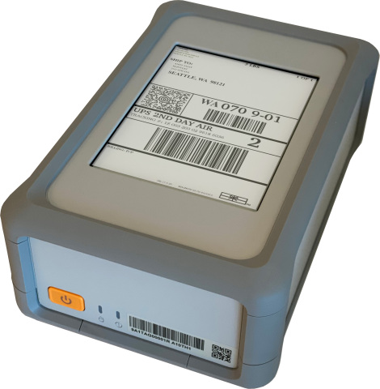
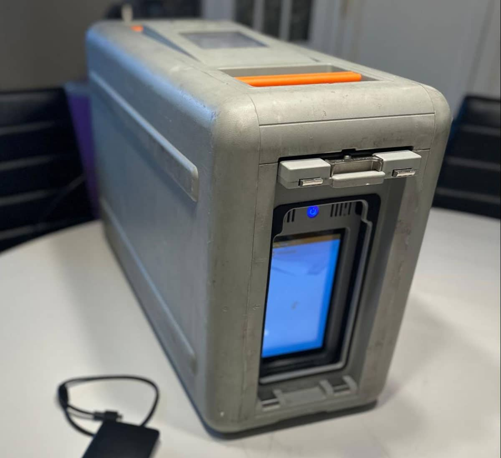
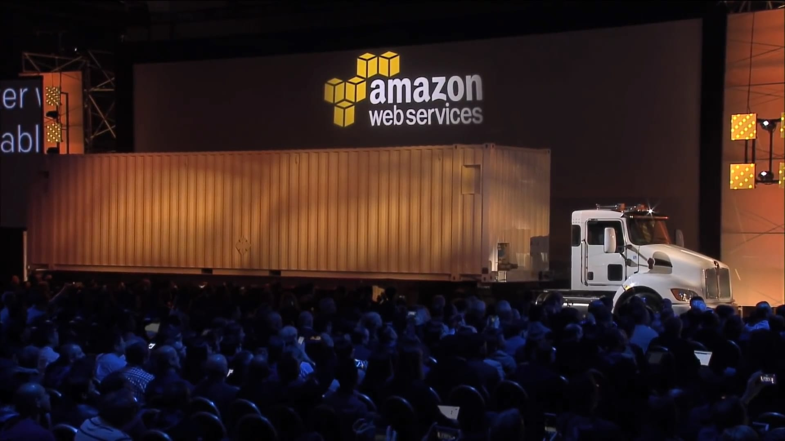

## Introduction du module 9 et objectifs

- Migration et l'innovation dans le Cloud AWS.
- Framework d'adoption du Cloud AWS (AWS CAF). 
- Les six facteurs clés d'une stratégie de migration dans le cloud.
- Avantages des solutions de migration de données AWS, telles qu'AWS Snowcone, AWS Snowball et AWS Snowmobile.
- Eventail de solutions innovantes qu'AWS offre.

---

## Framework d'adoption du Cloud AWS (AWS CAF)

La migration vers le cloud:

 

- Necessite une expertise
- Necessite une charge de travail
- Chaque profil dans l'entrprise à une vision différente

-> AWS Cloud Adoption CAF : fournit des conseil pour votre entreprise pour une migration réussi

C'est un plan d'action qui comporte six perspectives

---

## Six perspectives de base du Framework d'adoption du Cloud

- Perspective Entreprise
- Perspective Personnes
- Perspective Gouvernance
- Perspective Plateforme
- Perspective Sécurité
- Perspective Opérations

 

-  les perspectives Entreprise, Personnes et Gouvernance se concentrent sur les capacités de l'entreprise
-  les perspectives Plateforme, Sécurité et Opérations se concentrent sur les capacités techniques

---

## Perspective Entreprise

La perspective Entreprise veille à créer une harmonie entre l'informatique (IT) et les besoins de l'entreprise ainsi qu'à créer un lien entre les investissements informatiques et les principaux résultats opérationnels.

Les rôles courants de la perspective Entreprise incluent : 

- Responsables opérationnels
- Directeurs financiers
- Propriétaires de budget
- Parties prenantes stratégiques

---

## Perspective Personnes

La perspective Personnes (People) dans le AWS Cloud Adoption Framework (CAF) vise à préparer et à gérer le capital humain de votre organisation pour la transition vers le cloud.

- Préparer le Personnel : formation et certifications
- Gérer le Changement Organisationnel 
- Collaboration pour une gestion meilleure des ressources cloud

Les rôles courants de la perspective Personnes incluent : 

- Ressources humaines
- Effectifs
- Responsables des personnes

---

## Perspective Gouvernance

- Alignement avec les Objectifs de l'Entreprise : S'assurer que les initiatives cloud sont alignées avec les objectifs stratégiques de l'entreprise.
- Tableaux de Bord et Indicateurs de Performance :
- Suivi et Gestion des Ressources Cloud
- Gestion Financière pour optimiser les coûts

Les rôles communs de la perspective Gouvernance incluent : 

- Chief Information Officer (CIO)
- Responsables de programmes
- Enterprise Architects
- Analystes d'entreprise
- Responsables de portefeuille

---

## Perspective Plateforme

La perspective Plateforme inclut des principes et des modèles pour l'implémentation de nouvelles solutions dans le cloud et la migration des charges de travail sur site vers le cloud : architecture cible

Les rôles courants de la perspective Plateforme incluent : 

- Chief Technology Officer (CTO)
- Responsables informatiques
- Solutions Architects

---

## Perspective Sécurité

La perspective Sécurité garantit que l'organisation respecte les objectifs de sécurité en matière de visibilité, de capacité d'audit, de contrôle et d'agilité. 

Les rôles courants de la perspective Sécurité incluent : 

- Chief Information Security Officer (CISO)
- Responsables de la sécurité informatique (IT)
- Analystes de sécurité informatique (IT)

---

## Perspective Opérations

Assurer que les systèmes cloud fonctionnent efficacement et de manière fiable, tout en répondant aux besoins métier. Elle se concentre sur la gestion des opérations quotidiennes, la surveillance des performances, et l'optimisation continue des services cloud.

Les rôles courants de la perspective Opérations incluent : 

- Responsables des opérations informatiques (IT)
- Responsables du support informatique (IT)

---

<!-- .slide: data-auto-animate -->
#### Quiz: Quelle perspective du framework d'adoption du Cloud AWS vous permet de concevoir, d'implémenter et d'optimiser votre infrastructure AWS en fonction de vos perspectives et objectifs opérationnels ? <!-- .element: style="color:#fd9731;" -->

- Perspective Entreprise
- Perspective Plateforme
- Perspective Opérations
- Perspective Personnes

---

<!-- .slide: data-auto-animate -->
#### Quiz: Quelle perspective du framework d'adoption du Cloud AWS vous permet de concevoir, d'implémenter et d'optimiser votre infrastructure AWS en fonction de vos perspectives et objectifs opérationnels ? <!-- .element: style="color:#fd9731;" -->

- Perspective Entreprise
- Perspective Plateforme <!-- .element: style="color:#0de07d;" -->
- Perspective Opérations
- Perspective Personnes

---

## 6 stratégies de migration

- Réhébergement : Rehosting
- Restructuration : Replatforming
- Refactorisation/nouvelle conception d'architectures : Refactoring / Re-architecting 
- Rachat : Repurchasing
- Retenue : Retain
- Mise hors service : Retire

---

## Réhébergement

Le réhébergement (également connu sous le nom d'approche « lift and shift ») implique le déplacement d'applications sans modifications. 

Dans le scénario d'une migration héritée importante, dans lequel l'entreprise cherche à implémenter sa migration et à se mettre rapidement à l'échelle afin de répondre à une étude de cas, la majorité des applications sont réhébergées.  

---

## Restructuration

La restructuration de la plateforme (également connue sous le nom de « lift, tinker, and shift ») implique de réaliser quelques optimisations de cloud pour obtenir un avantage tangible. L'optimisation est assurée sans modifier l'architecture de base de l'application.

---

## Refactorisation/nouvelle conception d'architectures

- La refactorisation (également connue sous le nom de nouvelle conception d'architectures) consiste à réimaginer l'architecture et le développement d'une application à l'aide de fonctions natives cloud. 
- La refactorisation est motivée par un besoin important des entreprises d'ajouter des fonctions, de mettre à l'échelle ou de gonfler les performances ; des éléments difficiles à obtenir avec l'environnement existant de l'application.

---

## Rachat

- Le rachat consiste à passer d'une licence traditionnelle à un modèle de logiciel en tant que service (SaaS, Software-as-a-Service). 
- Par exemple, une entreprise peut choisir d'implémenter la stratégie de rachat en migrant d'un système de gestion des relations clients (CRM) vers Salesforce.com.

---

## Retenue

La retenue consiste à conserver les applications essentielles pour l'entreprise dans l'environnement source. Cela peut inclure des applications qui requièrent une refactorisation majeure avant de pouvoir être migrées, ou des tâches qui peuvent être reportées à une date ultérieure.

---

## Mise hors service

La mise hors service est le processus qui permet de supprimer des applications qui ne sont plus nécessaires.

---

<!-- .slide: data-auto-animate -->
## Quiz: Quelle stratégie de migration implique de passer à un produit différent ?

- Refactorisation
- Mise hors service
- Restructuration
- Rachat

---

<!-- .slide: data-auto-animate -->
## Quiz: Quelle stratégie de migration implique de passer à un produit différent ?

- Refactorisation
- Mise hors service
- Restructuration
- Rachat <!-- .element: style="color:#0de07d;" -->

---

## Elements de la gamme AWS Snow

ensemble de périphériques physiques qui permettent de transporter physiquement des données, jusqu'à plusieurs exaoctets, vers et hors d'AWS. 

<!-- .element height="55%" width="55%" --> 

---

## AWS Snowcone

- AWS Snowcone est un petit appareil edge de calcul et de transfert de données robuste et sécurisé. 
- Il dispose de 2 CPU, de 4 Go de mémoire et d'un maximum de 14 To de stockage utilisable.

---

<!-- .element height="55%" width="55%" --> 

---

## AWS Snowball

- Snowball Edge Storage Optimized conviennent aux migrations de données à grande échelle et aux flux de transfert récurrents, ainsi qu'aux besoins de calcul locaux qui exigent des capacités accrues. 
   - Stockage : 80 To de capacité de disque dur (HDD) pour les volumes par bloc et le stockage d'objets compatibles Amazon S3, et 1 To de capacité de disque SSD SATA pour les volumes par bloc. 
   - Calcul : 40 vCPU, et 80 Gio de mémoire pour prendre en charge les instances sbe1 Amazon EC2 (équivalentes aux C5).
- Snowball Edge Compute Optimized offre de puissantes ressources de calcul pour les cas d'utilisation tels que le machine learning, l'analyse Full Motion Video, l'analytique ou les piles de calcul locales. 
   - Stockage : 80 To de capacité HDD utilisable pour le stockage d'objets compatibles Amazon S3 ou les volumes par bloc compatibles Amazon EBS, et 28 To de capacité SSD NVMe utilisable pour les volumes de par bloc compatibles Amazon EBS. 
   - Calcul : 104 vCPU, 416 Gio de mémoire et 1 GPU NVIDIA Tesla V100 en option. Les périphériques exécutent des instances sbe-c et sbe-g Amazon EC2, qui sont équivalentes aux instances C5, M5a, G3 et P3.

---

<!-- .element height="55%" width="55%" --> 

---

## AWS Snowmobile 

- Service de transfert de données d'une capacité de plusieurs exaoctets qui permet de déplacer de très grandes quantités de données vers AWS. 
- Vous pouvez transférer jusqu'à 100 pétaoctets de données par le biais de Snowmobile, un conteneur robuste de près de 14 mètres de long tiré par un semi-remorque.

---

<!-- .element height="55%" width="55%" --> 

---

<!-- .slide: data-auto-animate -->
## Quiz: Quelle est la capacité de stockage de Snowball Edge Storage Optimized ?

- 40 To
- 60 To
- 80 To
- 100 To

---

<!-- .slide: data-auto-animate -->
## Quiz: Quelle est la capacité de stockage de Snowball Edge Storage Optimized ?

- 40 To
- 60 To
- 80 To <!-- .element: style="color:#0de07d;" -->
- 100 To

---

## Innovation avec AWS

- Amazon SageMaker et Amazon Augmented AI : modèles de machine learning
- Amazon Lex : Solution IA
- Amazon Textract : Extraire du texte et des données sur des documents
- AWS DeepRacer : Machine Learning pour les développeurs
- AWS Ground Station : Communication avec les satellites
  
---

## Amazon CodeWhisperer

- Compagnon de codage IA
- Analyse le code et les commentaires du développeurs
- Recherche des vulnérabilités dans le code
- Productivité des développeurs
- Génération automatique du code

---

<!-- .slide: data-auto-animate -->
## Quiz: Quel service vous aide à créer, former et déployer rapidement des modèles de machine learning ?

- Amazon Textract
- Amazon Lex
- AWS DeepRacer
- Amazon SageMaker

---

<!-- .slide: data-auto-animate -->
## Quiz: Quel service vous aide à créer, former et déployer rapidement des modèles de machine learning ?

- Amazon Textract
- Amazon Lex
- AWS DeepRacer
- Amazon SageMaker <!-- .element: style="color:#0de07d;" -->

---

<!-- .slide: data-auto-animate -->
## Quiz: Quelle perspective du Framework d'adoption du Cloud AWS vous permet de structurer la sélection et l'implémentation des contrôles ?

- Perspective Gouvernance
- Perspective Sécurité
- Perspective Opérations
- Perspective Entreprise

---

<!-- .slide: data-auto-animate -->
## Quiz: Quelle perspective du Framework d'adoption du Cloud AWS vous permet de structurer la sélection et l'implémentation des contrôles ?

- Perspective Gouvernance
- Perspective Sécurité <!-- .element: style="color:#0de07d;" -->
- Perspective Opérations
- Perspective Entreprise

---

<!-- .slide: data-auto-animate -->
## Quiz: Quelles sont les six stratégies de migration d'applications ? (Sélectionnez DEUX propositions.)

- Revisite
- Retenue
- Souvenir
- Redéveloppement
- Réhébergement

---

<!-- .slide: data-auto-animate -->
## Quiz: Quelles sont les six stratégies de migration d'applications ? (Sélectionnez DEUX propositions.)

- Revisite
- Retenue <!-- .element: style="color:#0de07d;" -->
- Souvenir
- Redéveloppement
- Réhébergement <!-- .element: style="color:#0de07d;" -->

---

<!-- .slide: data-auto-animate -->
## Quiz: Quelle est la capacité de stockage d'AWS Snowmobile ?

- 40 Po
- 60 Po
- 80 Po 
- 100 Po <!-- .element: style="color:#0de07d;" -->

---

<!-- .slide: data-auto-animate -->
## Quiz: Quelle affirmation décrit le mieux Amazon Lex ?

- Un service qui vous permet de créer des interfaces de conversation reposant sur la voix et le texte 
- Un service de machine learning qui extrait automatiquement du texte et des données depuis des documents numérisés
- Un service de base de données de documents qui prend en charge les charges de travail MongoDB
- Un service qui vous permet d'identifier les activités en ligne potentiellement frauduleuses

---

<!-- .slide: data-auto-animate -->
## Quiz: Quelle affirmation décrit le mieux Amazon Lex ?

- Un service qui vous permet de créer des interfaces de conversation reposant sur la voix et le texte <!-- .element: style="color:#0de07d;" -->
- Un service de machine learning qui extrait automatiquement du texte et des données depuis des documents numérisés
- Un service de base de données de documents qui prend en charge les charges de travail MongoDB
- Un service qui vous permet d'identifier les activités en ligne potentiellement frauduleuses
